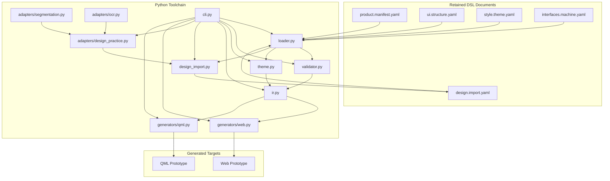
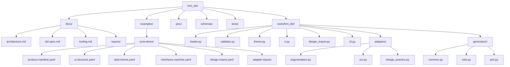
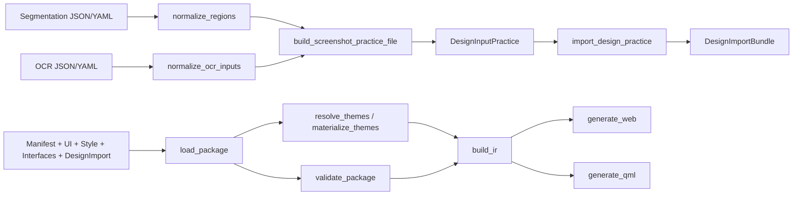
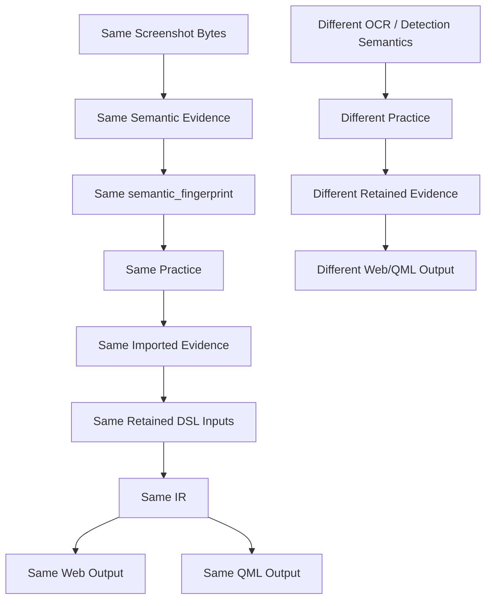

# Architecture Diagram

## 1. 文字说明

这张图描述当前仓库的工程结构、模块关系和数据边界。
重点是 retained documents、toolchain modules、IR、generators 之间的关系。

## 2. 顶层架构图

```mermaid
flowchart TB
    subgraph RetainedDocs[Retained DSL Documents]
        A[product.manifest.yaml]
        B[ui.structure.yaml]
        C[style.theme.yaml]
        D[interfaces.machine.yaml]
        E[design.import.yaml]
    end

    subgraph Toolchain[Python Toolchain]
        F[loader.py]
        G[validator.py]
        H[theme.py]
        I[ir.py]
        J[design_import.py]
        K[adapters/design_practice.py]
        L[adapters/segmentation.py]
        M[adapters/ocr.py]
        N[generators/web.py]
        O[generators/qml.py]
        P[cli.py]
    end

    subgraph Outputs[Generated Targets]
        Q[Web Prototype]
        R[QML Prototype]
    end

    A --> F
    B --> F
    C --> F
    D --> F
    E --> F

    F --> G
    F --> H
    F --> J
    H --> I
    G --> I
    J --> E
    I --> N
    I --> O
    N --> Q
    O --> R

    L --> K
    M --> K
    K --> J

    P --> F
    P --> G
    P --> H
    P --> I
    P --> J
    P --> K
    P --> N
    P --> O
```

## 3. 目录级工程结构图

```mermaid
flowchart TD
    A[hmi_dsl/]
    A --> B[docs/]
    A --> C[examples/]
    A --> D[pics/]
    A --> E[schemas/]
    A --> F[tests/]
    A --> G[tools/hmi_dsl/]

    B --> B1[architecture.md]
    B --> B2[dsl-spec.md]
    B --> B3[tooling.md]
    B --> B4[reports/]

    C --> C1[june-demo/]
    C1 --> C2[product.manifest.yaml]
    C1 --> C3[ui.structure.yaml]
    C1 --> C4[style.theme.yaml]
    C1 --> C5[interfaces.machine.yaml]
    C1 --> C6[design.import.yaml]
    C1 --> C7[adapter-inputs/]

    G --> G1[loader.py]
    G --> G2[validator.py]
    G --> G3[theme.py]
    G --> G4[ir.py]
    G --> G5[design_import.py]
    G --> G6[cli.py]
    G --> G7[adapters/]
    G --> G8[generators/]

    G7 --> G71[segmentation.py]
    G7 --> G72[ocr.py]
    G7 --> G73[design_practice.py]

    G8 --> G81[common.py]
    G8 --> G82[web.py]
    G8 --> G83[qml.py]
```

## 4. 数据流图

```mermaid
flowchart LR
    A[Segmentation JSON/YAML] --> B[normalize_regions]
    C[OCR JSON/YAML] --> D[normalize_ocr_inputs]
    B --> E[build_screenshot_practice_file]
    D --> E
    E --> F[DesignInputPractice]
    F --> G[import_design_practice]
    G --> H[DesignImportBundle]

    I[Manifest + UI + Style + Interfaces + DesignImport] --> J[load_package]
    J --> K[validate_package]
    J --> L[resolve_themes / materialize_themes]
    L --> M[build_ir]
    K --> M
    M --> N[generate_web]
    M --> O[generate_qml]
```

## 5. 一致性边界图

```mermaid
flowchart TB
    A[Same Screenshot Bytes] --> B[Same Semantic Evidence]
    B --> C[Same semantic_fingerprint]
    C --> D[Same Practice]
    D --> E[Same Imported Evidence]
    E --> F[Same Retained DSL Inputs]
    F --> G[Same IR]
    G --> H[Same Web Output]
    G --> I[Same QML Output]

    X[Different OCR / Detection Semantics] --> Y[Different Practice]
    Y --> Z[Different Retained Evidence]
    Z --> H2[Different Web/QML Output]
```
