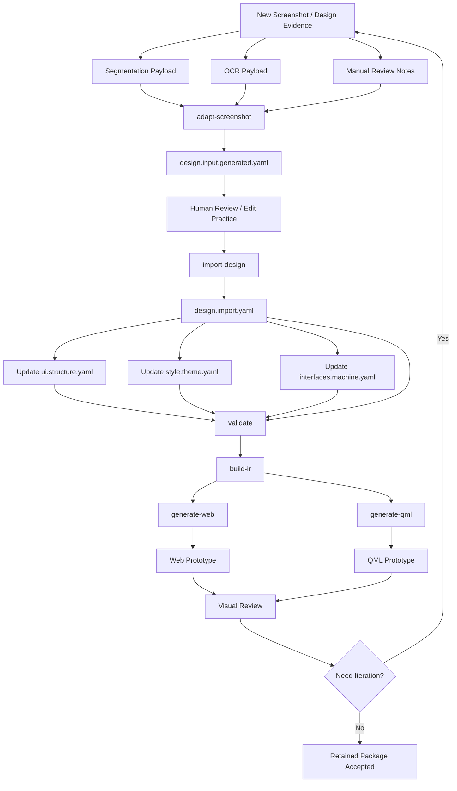
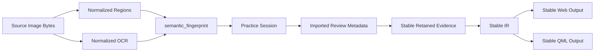

# Workflow Diagram

## 1. 文字说明

这张图描述“新图片进入工程后”从证据采集到 retained DSL，再到 Web/QML 产物的完整工作流。

## 2. Mermaid 工作流图



## 3. 一致性控制点



## 4. 实际命令链

```bash
python3 -m tools.hmi_dsl adapt-screenshot <manifest> --source <png> --regions <regions.json> --ocr <ocr.json> --output <practice.yaml>
python3 -m tools.hmi_dsl import-design <manifest> --practice <practice.yaml>
python3 -m tools.hmi_dsl validate <manifest>
python3 -m tools.hmi_dsl build-ir <manifest>
python3 -m tools.hmi_dsl generate-web <manifest> --output <web_dir>
python3 -m tools.hmi_dsl generate-qml <manifest> --output <qml_dir>
```
