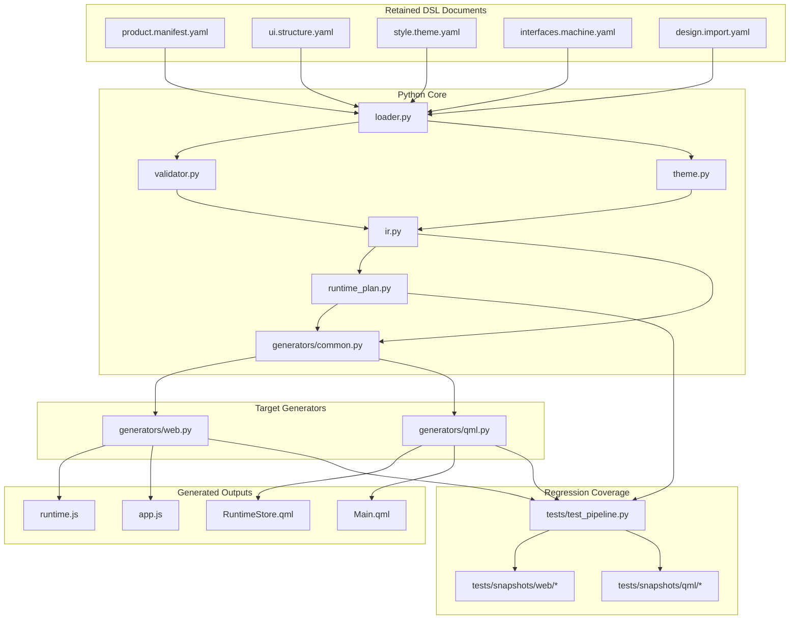
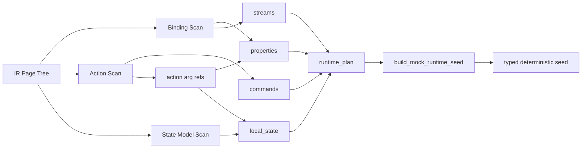
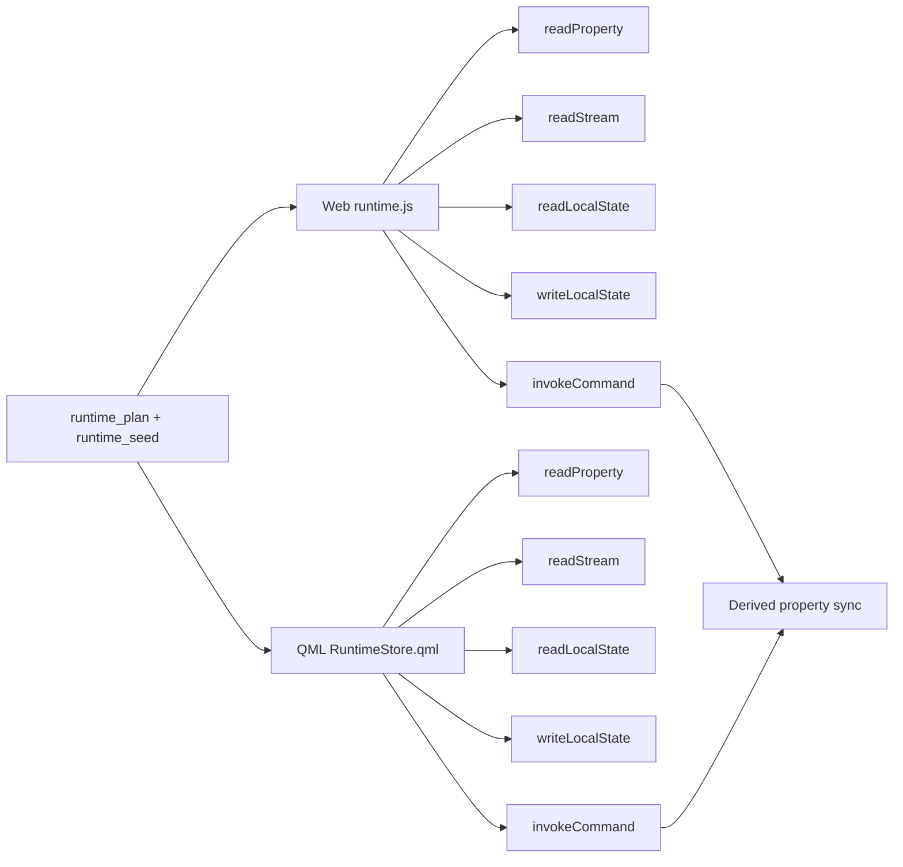
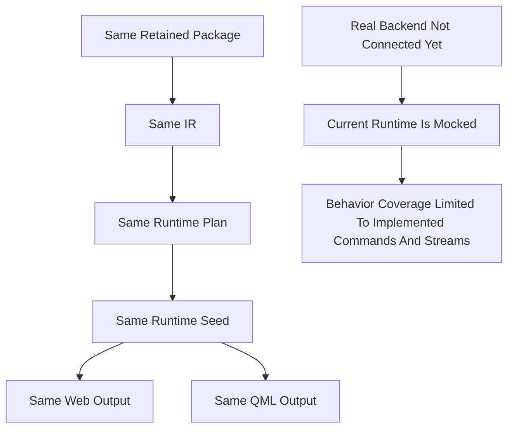

# Architecture Diagram

## 1. 文字说明

这张图描述当前仓库在 runtime planning 改造后的模块关系。
重点是 IR、runtime plan、generator payload、target runtime 和测试回归之间的连接方式。

## 2. 顶层模块关系图

## 3. runtime contract 结构图

## 4. target-side runtime 对称关系图

## 5. 当前验证边界图

