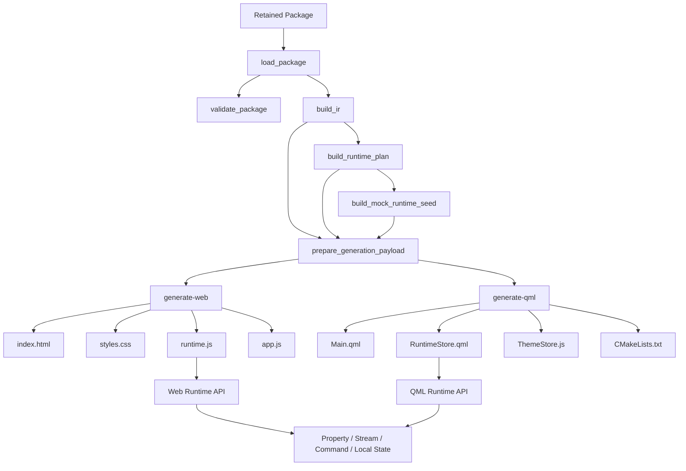
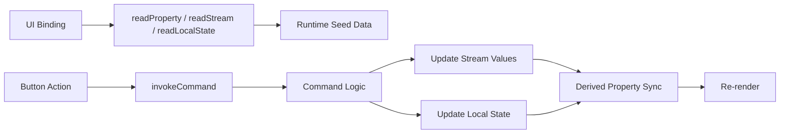
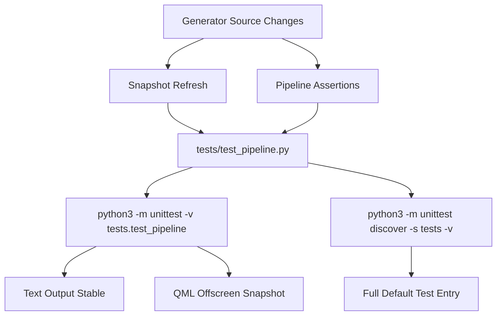

# Workflow Diagram

## 1. 文字说明

这张图描述当前 retained DSL 在引入 runtime plan 之后，如何生成可执行的 Web/QML 原型，以及测试如何锁定这条链路。

## 2. Mermaid 主工作流图



## 3. 运行时交互图



## 4. 验证路径



## 5. 实际命令链

```bash
python3 -m unittest -v tests.test_pipeline
python3 -m unittest discover -s tests -v
```
