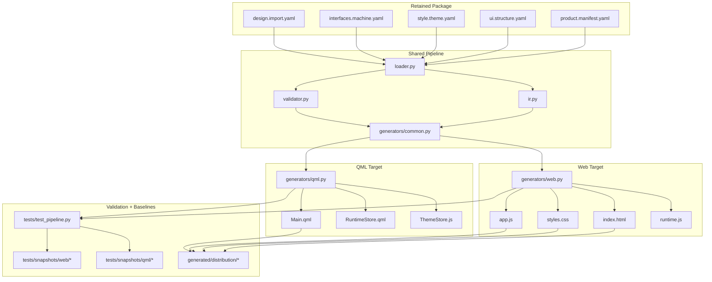
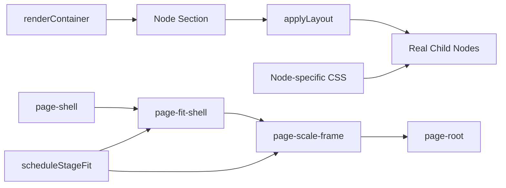
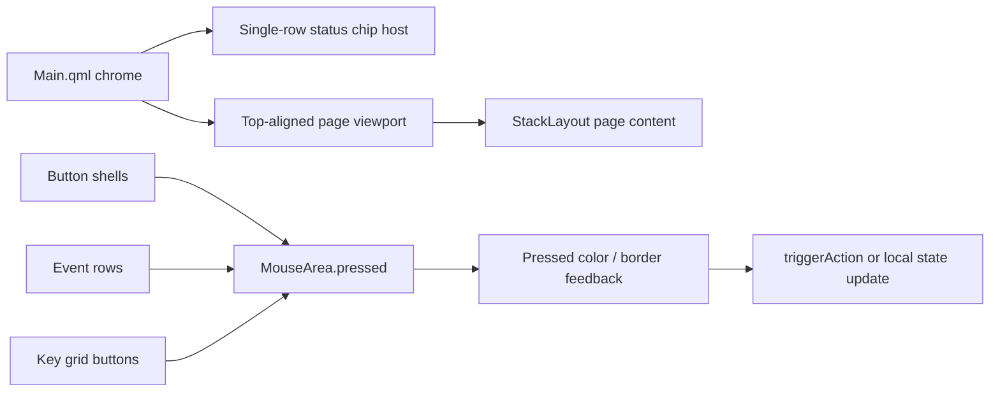
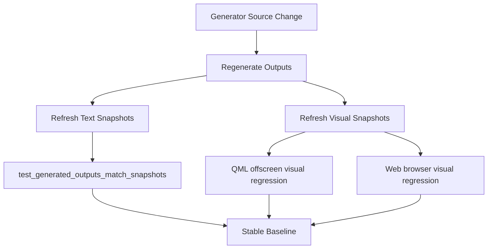

# Architecture Diagram

## 1. 文字说明

这张图描述当前仓库在 2026-04-10 这轮修复后的 target-side 结构关系。
重点是 generator 如何控制布局壳层、交互反馈层、视觉基线和最终分发产物。

## 2. 顶层模块关系图

```mermaid
flowchart TB
    subgraph Retained[Retained Package]
        A[product.manifest.yaml]
        B[ui.structure.yaml]
        C[style.theme.yaml]
        D[interfaces.machine.yaml]
        E[design.import.yaml]
    end

    subgraph Core[Shared Pipeline]
        F[loader.py]
        G[validator.py]
        H[ir.py]
        I[generators/common.py]
    end

    subgraph WebTarget[Web Target]
        J[generators/web.py]
        K[index.html]
        L[styles.css]
        M[app.js]
        N[runtime.js]
    end

    subgraph QmlTarget[QML Target]
        O[generators/qml.py]
        P[Main.qml]
        Q[RuntimeStore.qml]
        R[ThemeStore.js]
    end

    subgraph Validation[Validation + Baselines]
        S[tests/test_pipeline.py]
        T[tests/snapshots/web/*]
        U[tests/snapshots/qml/*]
        V[generated/distribution/*]
    end

    A --> F
    B --> F
    C --> F
    D --> F
    E --> F

    F --> G
    F --> H
    H --> I
    G --> I

    I --> J
    I --> O

    J --> K
    J --> L
    J --> M
    J --> N

    O --> P
    O --> Q
    O --> R

    J --> S
    O --> S
    S --> T
    S --> U

    K --> V
    L --> V
    M --> V
    P --> V
```

## 3. Web 布局控制图

```mermaid
flowchart LR
    A[renderContainer] --> B[Node Section]
    B --> C[applyLayout]
    C --> D[Real Child Nodes]

    E[Node-specific CSS]
    E --> D

    F[page-shell] --> G[page-fit-shell]
    G --> H[page-scale-frame]
    H --> I[page-root]

    J[scheduleStageFit] --> H
    J --> G
```

## 4. QML 布局与交互层图

```mermaid
flowchart LR
    A[Main.qml chrome] --> B[Single-row status chip host]
    A --> C[Top-aligned page viewport]
    C --> D[StackLayout page content]

    E[Button shells] --> F[MouseArea.pressed]
    G[Event rows] --> F
    H[Key grid buttons] --> F

    F --> I[Pressed color / border feedback]
    I --> J[triggerAction or local state update]
```

## 5. 回归保护图

```mermaid
flowchart TD
    A[Generator Source Change] --> B[Regenerate Outputs]
    B --> C[Refresh Text Snapshots]
    B --> D[Refresh Visual Snapshots]

    C --> E[test_generated_outputs_match_snapshots]
    D --> F[QML offscreen visual regression]
    D --> G[Web browser visual regression]

    E --> H[Stable Baseline]
    F --> H
    G --> H
```
