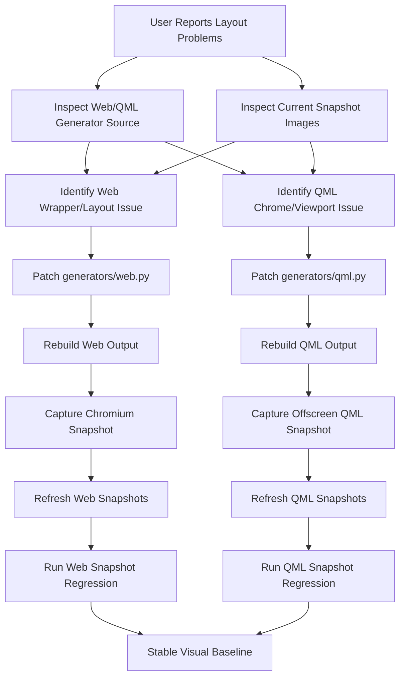
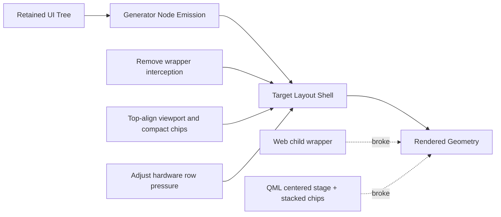
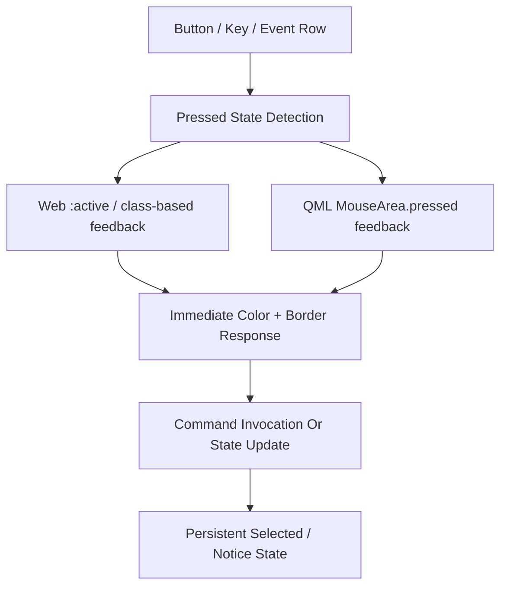

# Workflow Diagram

## 1. 文字说明

这张图描述当前这轮工作如何从用户提出的“HTML 布局异常、QML 顶部空白、按下无反馈”出发，进入 generator 修复、产物刷新和快照回归。

## 2. Mermaid 主工作流图



## 3. 布局修复路径图



## 4. 交互反馈路径



## 5. 实际命令链

```bash
./tools/generate_targets.sh
python3 -m tools.hmi_dsl validate examples/june-demo/product.manifest.yaml
python3 -m unittest tests.test_pipeline.PipelineTests.test_generated_outputs_match_snapshots
HMI_ENABLE_QML_VISUAL_SNAPSHOT=1 python3 -m unittest tests.test_pipeline.PipelineTests.test_qml_offscreen_snapshot_matches_baseline
HMI_ENABLE_WEB_VISUAL_SNAPSHOT=1 HMI_WEB_PLAYWRIGHT_ROOT=/tmp/hmi_web_snapshot_tooling HMI_WEB_RUNTIME_LIB_DIR=/tmp/hmi_web_runtime/usr/lib/x86_64-linux-gnu python3 -m unittest tests.test_pipeline.PipelineTests.test_web_browser_snapshot_matches_baseline
```
