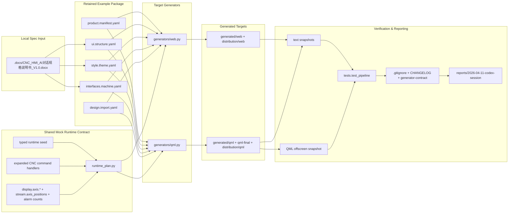

# Architecture Diagram

```mermaid
flowchart LR
    subgraph SpecInput[Local Spec Input]
        Docx[.docs/CNC_HMI_AI对话规格说明书_V1.0.docx]
    end

    subgraph RetainedPackage[Retained Example Package]
        Manifest[product.manifest.yaml]
        UI[ui.structure.yaml]
        Style[style.theme.yaml]
        Interfaces[interfaces.machine.yaml]
        DesignImport[design.import.yaml]
    end

    subgraph SharedRuntime[Shared Mock Runtime Contract]
        RuntimePlan[runtime_plan.py]
        Seed[typed runtime seed]
        Commands[expanded CNC command handlers]
        Derived[display.axis.* + stream.axis_positions + alarm counts]
    end

    subgraph Generators[Target Generators]
        WebGen[generators/web.py]
        QmlGen[generators/qml.py]
    end

    subgraph Targets[Generated Targets]
        Web[generated/web + distribution/web]
        QML[generated/qml + qml-final + distribution/qml]
    end

    subgraph Verification[Verification & Reporting]
        SnapText[text snapshots]
        SnapQml[QML offscreen snapshot]
        Tests[tests.test_pipeline]
        Docs[.gitignore + CHANGELOG + generator-contract]
        Report[reports/2026-04-11-codex-session]
    end

    Docx --> UI
    Docx --> Interfaces
    Docx --> Style

    Manifest --> WebGen
    UI --> WebGen
    Style --> WebGen
    Interfaces --> WebGen
    DesignImport --> WebGen

    Manifest --> QmlGen
    UI --> QmlGen
    Style --> QmlGen
    Interfaces --> QmlGen
    DesignImport --> QmlGen

    RuntimePlan --> WebGen
    RuntimePlan --> QmlGen
    Seed --> RuntimePlan
    Commands --> RuntimePlan
    Derived --> RuntimePlan

    WebGen --> Web
    QmlGen --> QML

    Web --> SnapText
    QML --> SnapText
    QML --> SnapQml
    SnapText --> Tests
    SnapQml --> Tests
    Tests --> Docs
    Docs --> Report
```
