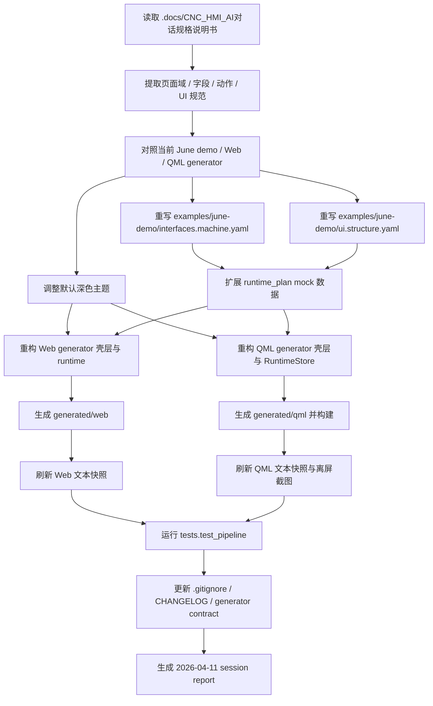

# Workflow Diagram

```mermaid
flowchart TD
    A[读取 .docs/CNC_HMI_AI对话规格说明书] --> B[提取页面域 / 字段 / 动作 / UI 规范]
    B --> C[对照当前 June demo / Web / QML generator]
    C --> D[重写 examples/june-demo/interfaces.machine.yaml]
    C --> E[重写 examples/june-demo/ui.structure.yaml]
    C --> F[调整默认深色主题]
    D --> G[扩展 runtime_plan mock 数据]
    E --> G
    F --> H[重构 Web generator 壳层与 runtime]
    G --> H
    F --> I[重构 QML generator 壳层与 RuntimeStore]
    G --> I
    H --> J[生成 generated/web]
    I --> K[生成 generated/qml 并构建]
    J --> L[刷新 Web 文本快照]
    K --> M[刷新 QML 文本快照与离屏截图]
    L --> N[运行 tests.test_pipeline]
    M --> N
    N --> O[更新 .gitignore / CHANGELOG / generator contract]
    O --> P[生成 2026-04-11 session report]
```
