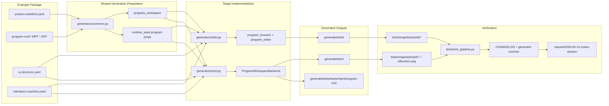

# Architecture Diagram

```mermaid
flowchart LR
    subgraph Package[Example Package]
        Manifest[product.manifest.yaml]
        ProgramRoot[program-root/*.MPF *.SPF]
        UI[ui.structure.yaml]
        Interfaces[interfaces.machine.yaml]
    end

    subgraph SharedPrep[Shared Generation Preparation]
        Common[generators/common.py]
        Workspace[program_workspace]
        Seed[runtime_seed program props]
    end

    subgraph Targets[Target Implementations]
        WebGen[generators/web.py]
        WebWidgets[program_browser + program_editor]
        QmlGen[generators/qml.py]
        Backend[ProgramWorkspaceBackend]
    end

    subgraph Outputs[Generated Outputs]
        WebOut[generated/web]
        QmlOut[generated/qml]
        Dist[generated/distribution/qml/program-root]
    end

    subgraph Verification[Verification]
        Tests[tests/test_pipeline.py]
        WebSnap[tests/snapshots/web/*]
        QmlSnap[tests/snapshots/qml/* + offscreen png]
        Docs[CHANGELOG + generator-contract]
        Report[reports/2026-04-12-codex-session]
    end

    Manifest --> Common
    ProgramRoot --> Common
    UI --> WebGen
    UI --> QmlGen
    Interfaces --> WebGen
    Interfaces --> QmlGen

    Common --> Workspace
    Common --> Seed
    Workspace --> WebGen
    Workspace --> QmlGen
    Seed --> WebGen
    Seed --> QmlGen

    WebGen --> WebWidgets
    QmlGen --> Backend
    WebWidgets --> WebOut
    Backend --> QmlOut
    Backend --> Dist

    WebOut --> WebSnap
    QmlOut --> QmlSnap
    WebSnap --> Tests
    QmlSnap --> Tests
    Tests --> Docs
    Docs --> Report
```
