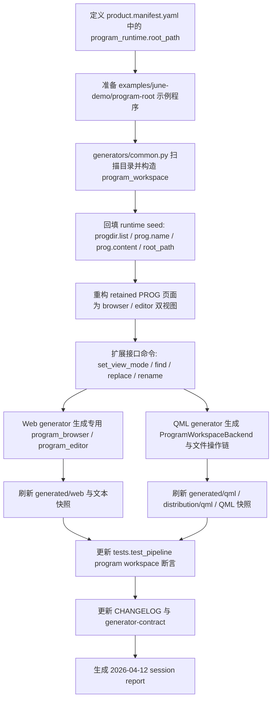

# Workflow Diagram

```mermaid
flowchart TD
    A[定义 product.manifest.yaml 中的 program_runtime.root_path] --> B[准备 examples/june-demo/program-root 示例程序]
    B --> C[generators/common.py 扫描目录并构造 program_workspace]
    C --> D[回填 runtime seed: progdir.list / prog.name / prog.content / root_path]
    D --> E[重构 retained PROG 页面为 browser / editor 双视图]
    E --> F[扩展接口命令: set_view_mode / find / replace / rename]
    F --> G[Web generator 生成专用 program_browser / program_editor]
    F --> H[QML generator 生成 ProgramWorkspaceBackend 与文件操作链]
    G --> I[刷新 generated/web 与文本快照]
    H --> J[刷新 generated/qml / distribution/qml / QML 快照]
    I --> K[更新 tests.test_pipeline program workspace 断言]
    J --> K
    K --> L[更新 CHANGELOG 与 generator-contract]
    L --> M[生成 2026-04-12 session report]
```
