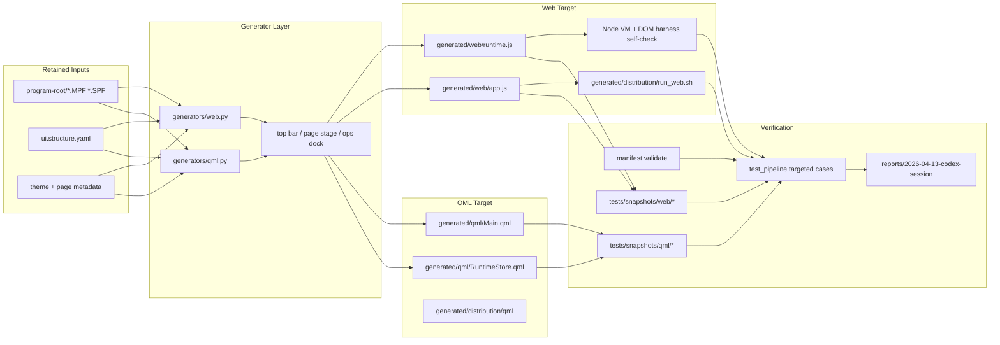

# Architecture Diagram

```mermaid
flowchart LR
    subgraph Retained[Retained Inputs]
        ProgramRoot[program-root/*.MPF *.SPF]
        UI[ui.structure.yaml]
        Theme[theme + page metadata]
    end

    subgraph Generators[Generator Layer]
        WebGen[generators/web.py]
        QmlGen[generators/qml.py]
        Targets[top bar / page stage / ops dock]
    end

    subgraph WebTarget[Web Target]
        Runtime[generated/web/runtime.js]
        App[generated/web/app.js]
        RunWeb[generated/distribution/run_web.sh]
        Harness[Node VM + DOM harness self-check]
    end

    subgraph QmlTarget[QML Target]
        MainQml[generated/qml/Main.qml]
        RuntimeStore[generated/qml/RuntimeStore.qml]
        DistQml[generated/distribution/qml]
    end

    subgraph Verification[Verification]
        Validate[manifest validate]
        Tests[test_pipeline targeted cases]
        WebSnap[tests/snapshots/web/*]
        QmlSnap[tests/snapshots/qml/*]
        Report[reports/2026-04-13-codex-session]
    end

    ProgramRoot --> WebGen
    ProgramRoot --> QmlGen
    UI --> WebGen
    UI --> QmlGen
    Theme --> WebGen
    Theme --> QmlGen

    WebGen --> Targets
    QmlGen --> Targets

    Targets --> Runtime
    Targets --> App
    Targets --> MainQml
    Targets --> RuntimeStore
    App --> RunWeb
    Runtime --> Harness

    Runtime --> WebSnap
    App --> WebSnap
    MainQml --> QmlSnap
    RuntimeStore --> QmlSnap
    RunWeb --> Tests
    Harness --> Tests
    Validate --> Tests
    WebSnap --> Tests
    QmlSnap --> Tests
    Tests --> Report
```
