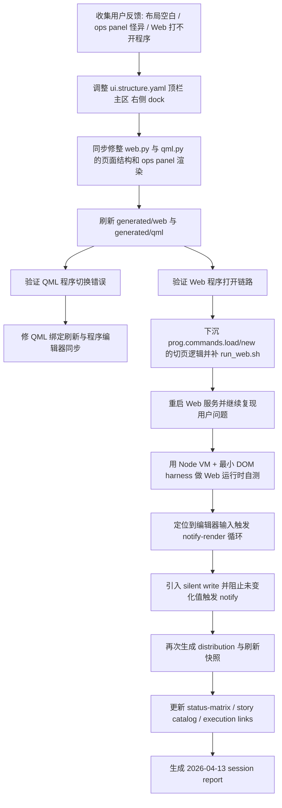

# Workflow Diagram

```mermaid
flowchart TD
    A[收集用户反馈: 布局空白 / ops panel 怪异 / Web 打不开程序] --> B[调整 ui.structure.yaml 顶栏 主区 右侧 dock]
    B --> C[同步修整 web.py 与 qml.py 的页面结构和 ops panel 渲染]
    C --> D[刷新 generated/web 与 generated/qml]
    D --> E[验证 QML 程序切换错误]
    E --> F[修 QML 绑定刷新与程序编辑器同步]
    D --> G[验证 Web 程序打开链路]
    G --> H[下沉 prog.commands.load/new 的切页逻辑并补 run_web.sh]
    H --> I[重启 Web 服务并继续复现用户问题]
    I --> J[用 Node VM + 最小 DOM harness 做 Web 运行时自测]
    J --> K[定位到编辑器输入触发 notify-render 循环]
    K --> L[引入 silent write 并阻止未变化值触发 notify]
    L --> M[再次生成 distribution 与刷新快照]
    M --> N[更新 status-matrix / story catalog / execution links]
    N --> O[生成 2026-04-13 session report]
```
