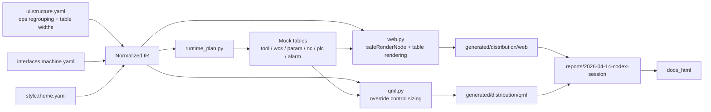

# Architecture Diagram

```mermaid
flowchart LR
    UI[ui.structure.yaml<br/>ops regrouping + table widths] --> IR[Normalized IR]
    IF[interfaces.machine.yaml] --> IR
    THEME[style.theme.yaml] --> IR
    IR --> PLAN[runtime_plan.py]
    PLAN --> SEED[Mock tables<br/>tool / wcs / param / nc / plc / alarm]
    IR --> WEB[web.py<br/>safeRenderNode + table rendering]
    IR --> QML[qml.py<br/>override control sizing]
    SEED --> WEB
    SEED --> QML
    WEB --> DISTWEB[generated/distribution/web]
    QML --> DISTQML[generated/distribution/qml]
    DISTWEB --> REPORT[reports/2026-04-14-codex-session]
    DISTQML --> REPORT
    REPORT --> PORTAL[docs_html]
```
