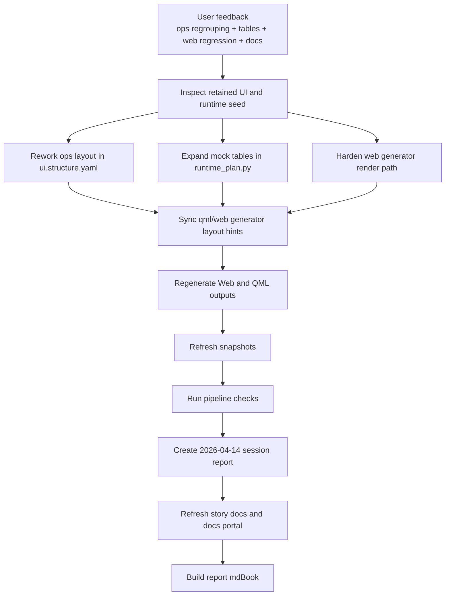

# Workflow Diagram

```mermaid
flowchart TD
    U[User feedback<br/>ops regrouping + tables + web regression + docs] --> A[Inspect retained UI and runtime seed]
    A --> B[Rework ops layout in ui.structure.yaml]
    A --> C[Expand mock tables in runtime_plan.py]
    A --> D[Harden web generator render path]
    B --> E[Sync qml/web generator layout hints]
    C --> E
    D --> E
    E --> F[Regenerate Web and QML outputs]
    F --> G[Refresh snapshots]
    G --> H[Run pipeline checks]
    H --> I[Create 2026-04-14 session report]
    I --> J[Refresh story docs and docs portal]
    J --> K[Build report mdBook]
```
