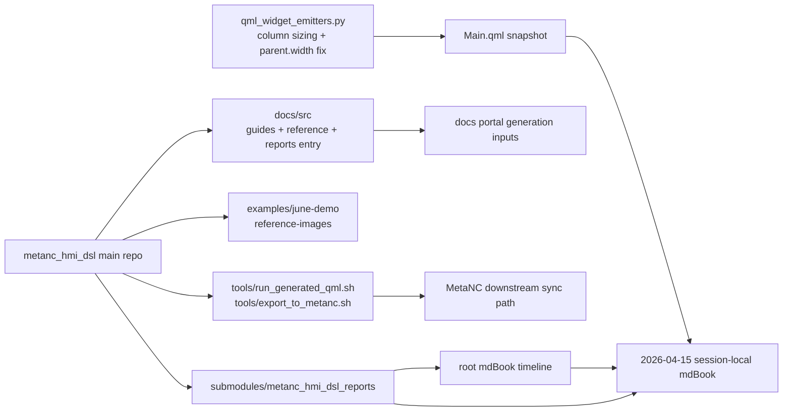

# Architecture Diagram

```mermaid
flowchart LR
    QMLSRC[qml_widget_emitters.py<br/>column sizing + parent.width fix] --> QMLSNAP[Main.qml snapshot]
    MAIN[metanc_hmi_dsl main repo] --> DOCS[docs/src<br/>guides + reference + reports entry]
    MAIN --> EXAMPLE[examples/june-demo<br/>reference-images]
    MAIN --> TOOLS[tools/run_generated_qml.sh<br/>tools/export_to_metanc.sh]
    MAIN --> REPORTS[submodules/metanc_hmi_dsl_reports]
    REPORTS --> ROOTBOOK[root mdBook timeline]
    REPORTS --> SESSIONBOOK[2026-04-15 session-local mdBook]
    DOCS --> PORTAL[docs portal generation inputs]
    TOOLS --> DOWNSTREAM[MetaNC downstream sync path]
    QMLSNAP --> SESSIONBOOK
    ROOTBOOK --> SESSIONBOOK
```
