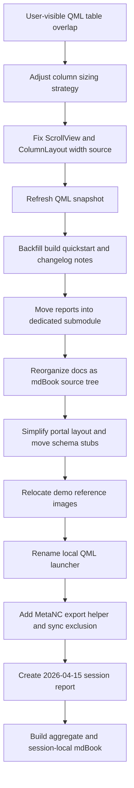

# Workflow Diagram

```mermaid
flowchart TD
    U[User-visible QML table overlap] --> A[Adjust column sizing strategy]
    A --> B[Fix ScrollView and ColumnLayout width source]
    B --> C[Refresh QML snapshot]
    C --> D[Backfill build quickstart and changelog notes]
    D --> E[Move reports into dedicated submodule]
    E --> F[Reorganize docs as mdBook source tree]
    F --> G[Simplify portal layout and move schema stubs]
    G --> H[Relocate demo reference images]
    H --> I[Rename local QML launcher]
    I --> J[Add MetaNC export helper and sync exclusion]
    J --> K[Create 2026-04-15 session report]
    K --> L[Build aggregate and session-local mdBook]
```
