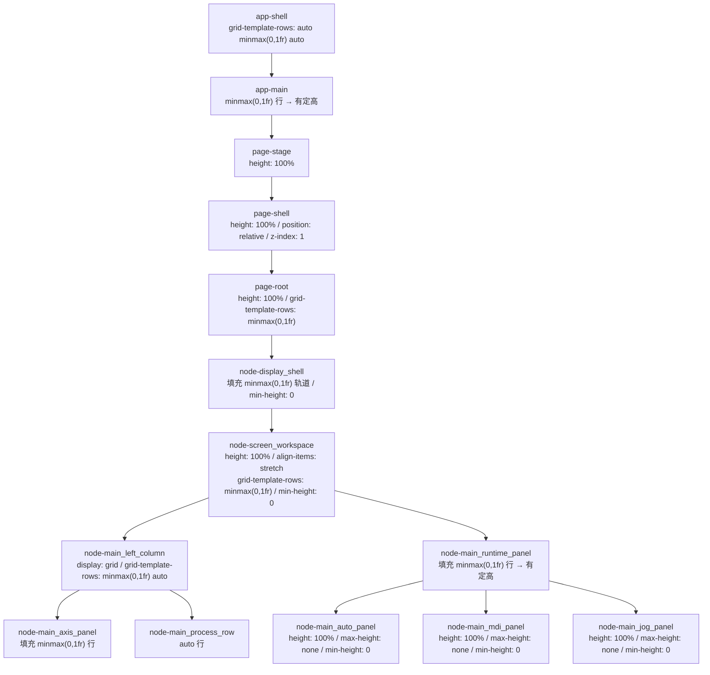
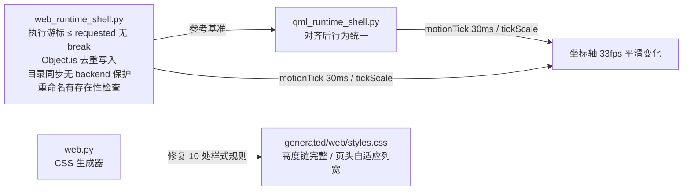

# Architecture Diagram

## CSS 高度链修复路径

```mermaid
flowchart TD
    APPSHELL["app-shell<br/>grid-template-rows: auto minmax(0,1fr) auto"] --> APPMAIN["app-main<br/>minmax(0,1fr) 行 → 有定高"]
    APPMAIN --> PAGESTAGE["page-stage<br/>height: 100%"]
    PAGESTAGE --> PAGESHELL["page-shell<br/>height: 100% / position: relative / z-index: 1"]
    PAGESHELL --> PAGEROOT["page-root<br/>height: 100% / grid-template-rows: minmax(0,1fr)"]
    PAGEROOT --> DISPLAYSHELL["node-display_shell<br/>填充 minmax(0,1fr) 轨道 / min-height: 0"]
    DISPLAYSHELL --> SCREENWS["node-screen_workspace<br/>height: 100% / align-items: stretch<br/>grid-template-rows: minmax(0,1fr) / min-height: 0"]
    SCREENWS --> LEFTCOL["node-main_left_column<br/>display: grid / grid-template-rows: minmax(0,1fr) auto"]
    SCREENWS --> RTPANEL["node-main_runtime_panel<br/>填充 minmax(0,1fr) 行 → 有定高"]
    LEFTCOL --> AXISPANEL["node-main_axis_panel<br/>填充 minmax(0,1fr) 行"]
    LEFTCOL --> PROCESSROW["node-main_process_row<br/>auto 行"]
    RTPANEL --> AUTOPANEL["node-main_auto_panel<br/>height: 100% / max-height: none / min-height: 0"]
    RTPANEL --> MDIPANEL["node-main_mdi_panel<br/>height: 100% / max-height: none / min-height: 0"]
    RTPANEL --> JOGPANEL["node-main_jog_panel<br/>height: 100% / max-height: none / min-height: 0"]
```

## 运行时对齐结构

```mermaid
flowchart LR
    WEBRT["web_runtime_shell.py<br/>执行游标 ≤ requested 无 break<br/>Object.is 去重写入<br/>目录同步无 backend 保护<br/>重命名有存在性检查"] -- 参考基准 --> QMLRT["qml_runtime_shell.py<br/>对齐后行为统一"]
    WEBRT -- motionTick 30ms / tickScale --> SMOOTHNESS["坐标轴 33fps 平滑变化"]
    QMLRT -- motionTick 30ms / tickScale --> SMOOTHNESS
    WEB_PY["web.py<br/>CSS 生成器"] -- 修复 10 处样式规则 --> STYLES["generated/web/styles.css<br/>高度链完整 / 页头自适应列宽"]
```
