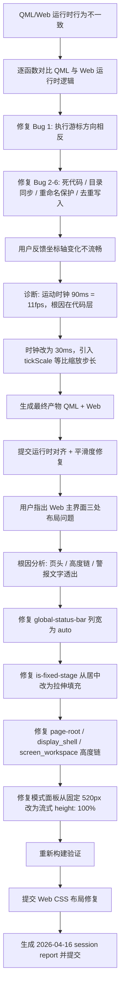

# Workflow Diagram

```mermaid
flowchart TD
    U[QML/Web 运行时行为不一致] --> A[逐函数对比 QML 与 Web 运行时逻辑]
    A --> B[修复 Bug 1: 执行游标方向相反]
    B --> C[修复 Bug 2-6: 死代码 / 目录同步 / 重命名保护 / 去重写入]
    C --> D[用户反馈坐标轴变化不流畅]
    D --> E[诊断: 运动时钟 90ms = 11fps，根因在代码层]
    E --> F[时钟改为 30ms，引入 tickScale 等比缩放步长]
    F --> G[生成最终产物 QML + Web]
    G --> H[提交运行时对齐 + 平滑度修复]
    H --> I[用户指出 Web 主界面三处布局问题]
    I --> J[根因分析: 页头 / 高度链 / 警报文字透出]
    J --> K[修复 global-status-bar 列宽为 auto]
    K --> L[修复 is-fixed-stage 从居中改为拉伸填充]
    L --> M[修复 page-root / display_shell / screen_workspace 高度链]
    M --> N[修复模式面板从固定 520px 改为流式 height: 100%]
    N --> O[重新构建验证]
    O --> P[提交 Web CSS 布局修复]
    P --> Q[生成 2026-04-16 session report 并提交]
```
