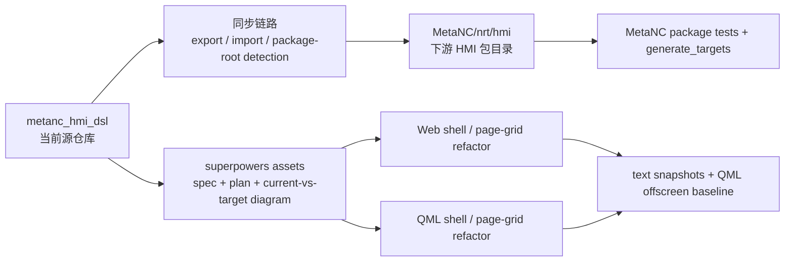
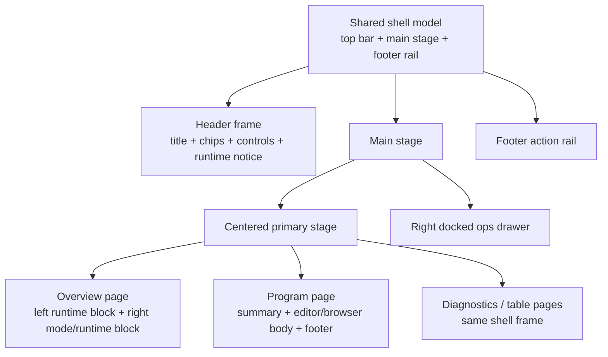
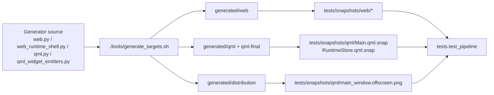

# Architecture Diagram

## 当天两条主线的关系

```mermaid
flowchart LR
    SRC["metanc_hmi_dsl<br/>当前源仓库"] --> SYNC["同步链路<br/>export / import / package-root detection"]
    SYNC --> PKG["MetaNC/nrt/hmi<br/>下游 HMI 包目录"]

    SRC --> SUPER["superpowers assets<br/>spec + plan + current-vs-target diagram"]
    SUPER --> WEB["Web shell / page-grid refactor"]
    SUPER --> QML["QML shell / page-grid refactor"]

    WEB --> SNAP["text snapshots + QML offscreen baseline"]
    QML --> SNAP
    PKG --> VERIFY["MetaNC package tests + generate_targets"]
```

## 壳层统一后的目标结构

```mermaid
flowchart TD
    SHELL["Shared shell model<br/>top bar + main stage + footer rail"] --> HEADER["Header frame<br/>title + chips + controls + runtime notice"]
    SHELL --> STAGE["Main stage"]
    SHELL --> FOOTER["Footer action rail"]

    STAGE --> MAIN["Centered primary stage"]
    STAGE --> OPS["Right docked ops drawer"]

    MAIN --> OVERVIEW["Overview page<br/>left runtime block + right mode/runtime block"]
    MAIN --> PROGRAM["Program page<br/>summary + editor/browser body + footer"]
    MAIN --> DIAG["Diagnostics / table pages<br/>same shell frame"]
```

## 基线与验证结构

```mermaid
flowchart LR
    GEN["Generator source<br/>web.py / web_runtime_shell.py / qml.py / qml_widget_emitters.py"] --> BUILD["./tools/generate_targets.sh"]
    BUILD --> WEBOUT["generated/web"]
    BUILD --> QMLOUT["generated/qml + qml-final"]
    BUILD --> DIST["generated/distribution"]

    WEBOUT --> WEBSNAP["tests/snapshots/web/*"]
    QMLOUT --> QMLSNAP["tests/snapshots/qml/Main.qml.snap<br/>RuntimeStore.qml.snap"]
    DIST --> QMLIMG["tests/snapshots/qml/main_window.offscreen.png"]

    WEBSNAP --> PIPELINE["tests.test_pipeline"]
    QMLSNAP --> PIPELINE
    QMLIMG --> PIPELINE
```
