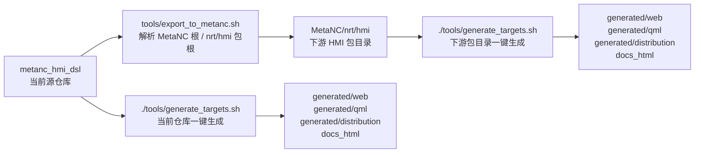
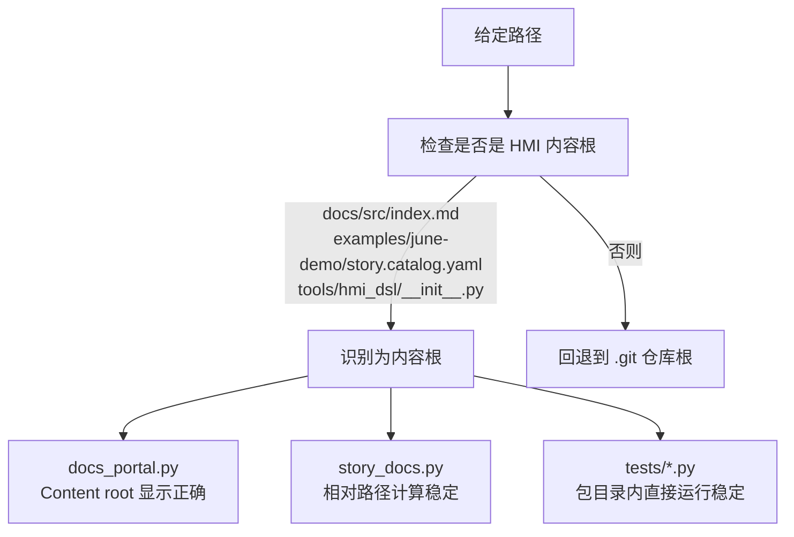
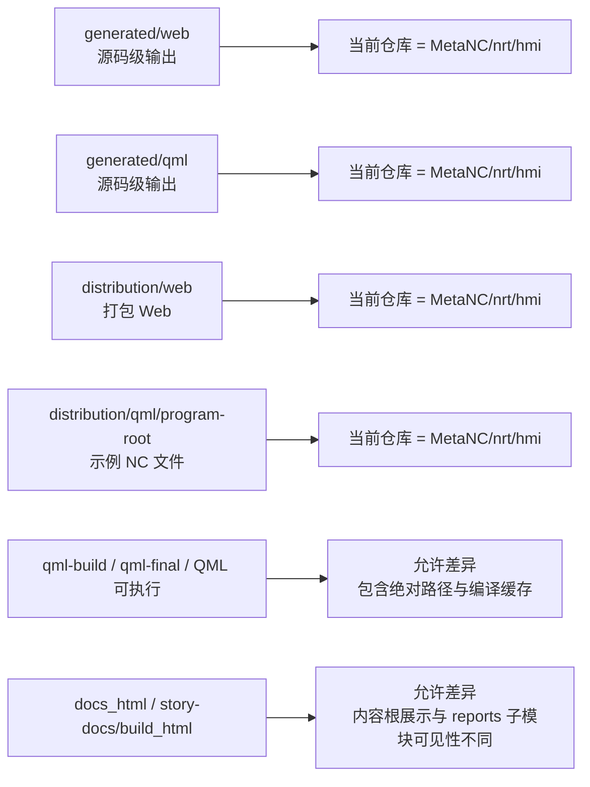

# Architecture Diagram

## 当前仓库与下游包目录关系

```mermaid
flowchart LR
    SRC["metanc_hmi_dsl<br/>当前源仓库"] --> EXPORT["tools/export_to_metanc.sh<br/>解析 MetaNC 根 / nrt/hmi 包根"]
    EXPORT --> PKG["MetaNC/nrt/hmi<br/>下游 HMI 包目录"]

    SRC --> BUILD1["./tools/generate_targets.sh<br/>当前仓库一键生成"]
    PKG --> BUILD2["./tools/generate_targets.sh<br/>下游包目录一键生成"]

    BUILD1 --> SRC_OUT["generated/web<br/>generated/qml<br/>generated/distribution<br/>docs_html"]
    BUILD2 --> PKG_OUT["generated/web<br/>generated/qml<br/>generated/distribution<br/>docs_html"]
```

## 内容根识别结构

```mermaid
flowchart TD
    INPUT["给定路径"] --> CHECK["检查是否是 HMI 内容根"]
    CHECK -->|docs/src/index.md<br/>examples/june-demo/story.catalog.yaml<br/>tools/hmi_dsl/__init__.py| HMIROOT["识别为内容根"]
    CHECK -->|否则| GITROOT["回退到 .git 仓库根"]

    HMIROOT --> DOCS["docs_portal.py<br/>Content root 显示正确"]
    HMIROOT --> STORY["story_docs.py<br/>相对路径计算稳定"]
    HMIROOT --> TESTS["tests/*.py<br/>包目录内直接运行稳定"]
```

## 产物一致性与可解释差异

```mermaid
flowchart LR
    WEBSRC["generated/web<br/>源码级输出"] --> SAME1["当前仓库 = MetaNC/nrt/hmi"]
    QMLSRC["generated/qml<br/>源码级输出"] --> SAME2["当前仓库 = MetaNC/nrt/hmi"]
    DISTWEB["distribution/web<br/>打包 Web"] --> SAME3["当前仓库 = MetaNC/nrt/hmi"]
    PROGS["distribution/qml/program-root<br/>示例 NC 文件"] --> SAME4["当前仓库 = MetaNC/nrt/hmi"]

    QMLBIN["qml-build / qml-final / QML 可执行"] --> DIFF1["允许差异<br/>包含绝对路径与编译缓存"]
    DOCSHTML["docs_html / story-docs/build_html"] --> DIFF2["允许差异<br/>内容根展示与 reports 子模块可见性不同"]
```
