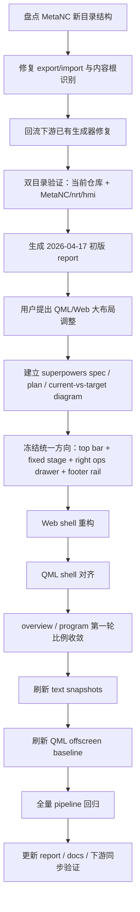

# Workflow Diagram

```mermaid
flowchart TD
    A[盘点 MetaNC 新目录结构] --> B[修复 export/import 与内容根识别]
    B --> C[回流下游已有生成器修复]
    C --> D[双目录验证：当前仓库 + MetaNC/nrt/hmi]
    D --> E[生成 2026-04-17 初版 report]
    E --> F[用户提出 QML/Web 大布局调整]
    F --> G[建立 superpowers spec / plan / current-vs-target diagram]
    G --> H[冻结统一方向：top bar + fixed stage + right ops drawer + footer rail]
    H --> I[Web shell 重构]
    I --> J[QML shell 对齐]
    J --> K[overview / program 第一轮比例收敛]
    K --> L[刷新 text snapshots]
    L --> M[刷新 QML offscreen baseline]
    M --> N[全量 pipeline 回归]
    N --> O[更新 report / docs / 下游同步验证]
```
