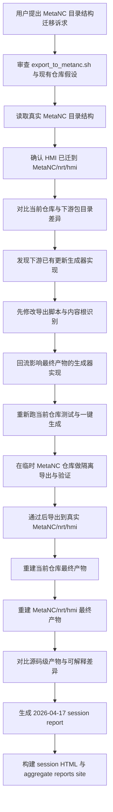

# Workflow Diagram

```mermaid
flowchart TD
    U[用户提出 MetaNC 目录结构迁移诉求] --> A[审查 export_to_metanc.sh 与现有仓库假设]
    A --> B[读取真实 MetaNC 目录结构]
    B --> C[确认 HMI 已迁到 MetaNC/nrt/hmi]
    C --> D[对比当前仓库与下游包目录差异]
    D --> E[发现下游已有更新生成器实现]
    E --> F[先修改导出脚本与内容根识别]
    F --> G[回流影响最终产物的生成器实现]
    G --> H[重新跑当前仓库测试与一键生成]
    H --> I[在临时 MetaNC 仓库做隔离导出与验证]
    I --> J[通过后导出到真实 MetaNC/nrt/hmi]
    J --> K[重建当前仓库最终产物]
    K --> L[重建 MetaNC/nrt/hmi 最终产物]
    L --> M[对比源码级产物与可解释差异]
    M --> N[生成 2026-04-17 session report]
    N --> O[构建 session HTML 与 aggregate reports site]
```
