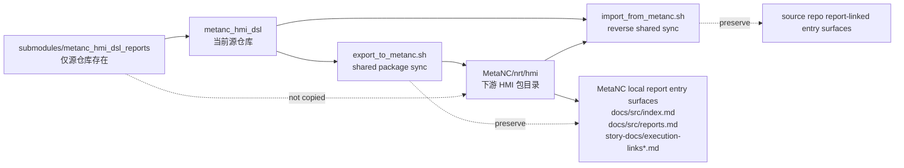
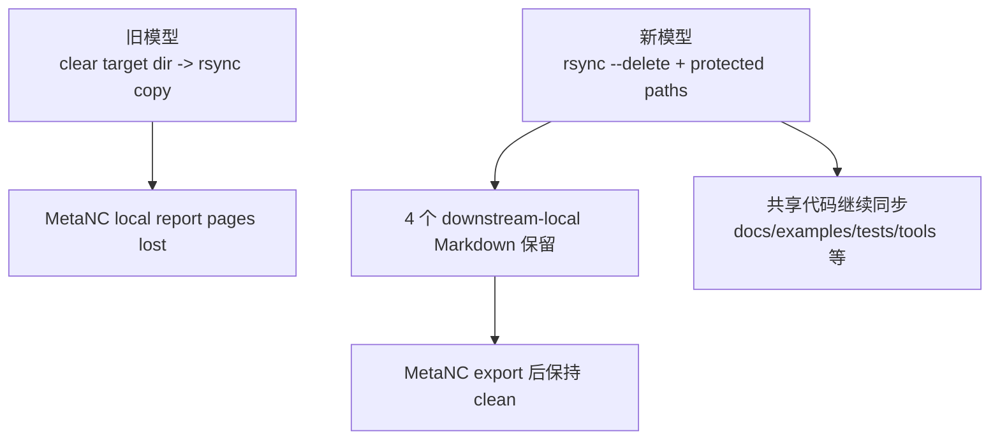
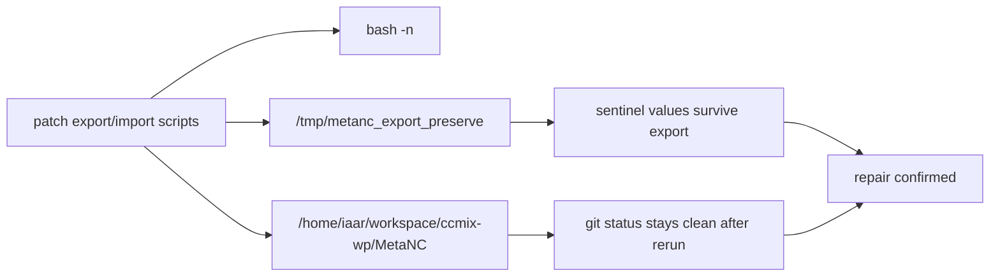

# Architecture Diagram

## 同步保护对象关系

```mermaid
flowchart LR
    SRC["metanc_hmi_dsl<br/>当前源仓库"] --> EXPORT["export_to_metanc.sh<br/>shared package sync"]
    SRC --> IMPORT["import_from_metanc.sh<br/>reverse shared sync"]
    EXPORT --> PKG["MetaNC/nrt/hmi<br/>下游 HMI 包目录"]
    PKG --> IMPORT

    REPORTS["submodules/metanc_hmi_dsl_reports<br/>仅源仓库存在"] --> SRC
    REPORTS -.not copied.-> PKG

    PKG --> LOCALDOCS["MetaNC local report entry surfaces<br/>docs/src/index.md<br/>docs/src/reports.md<br/>story-docs/execution-links*.md"]
    EXPORT -.preserve.-> LOCALDOCS
    IMPORT -.preserve.-> SRCLOCAL["source repo report-linked entry surfaces"]
```

## 导出修复后的同步模型

```mermaid
flowchart TD
    OLD["旧模型<br/>clear target dir -> rsync copy"] --> BAD["MetaNC local report pages lost"]
    NEW["新模型<br/>rsync --delete + protected paths"] --> KEEP["4 个 downstream-local Markdown 保留"]

    NEW --> SHARED["共享代码继续同步<br/>docs/examples/tests/tools 等"]
    KEEP --> CLEAN["MetaNC export 后保持 clean"]
```

## 验证结构

```mermaid
flowchart LR
    PATCH["patch export/import scripts"] --> SHELLCHECK["bash -n"]
    PATCH --> TMP["/tmp/metanc_export_preserve"]
    PATCH --> REAL["/home/iaar/workspace/ccmix-wp/MetaNC"]

    TMP --> SENTINEL["sentinel values survive export"]
    REAL --> CLEAN["git status stays clean after rerun"]
    SENTINEL --> RESULT["repair confirmed"]
    CLEAN --> RESULT
```
