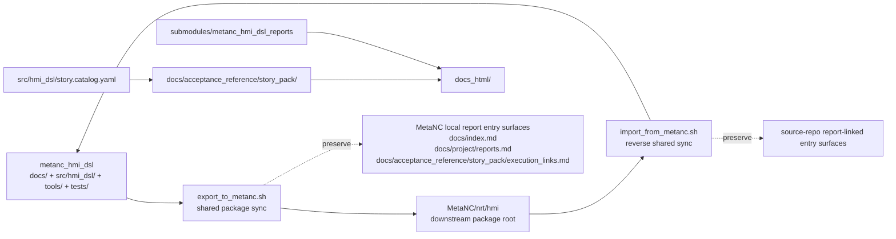
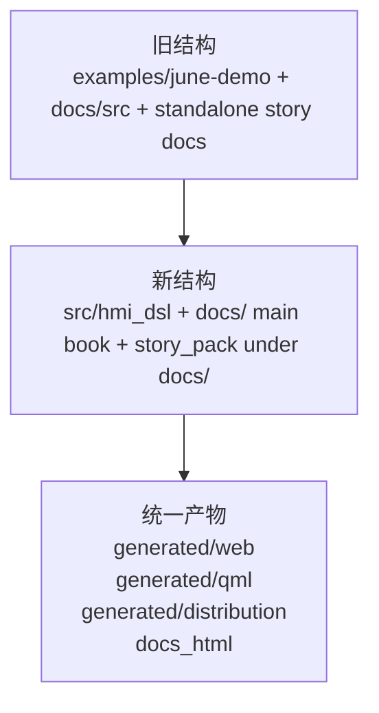
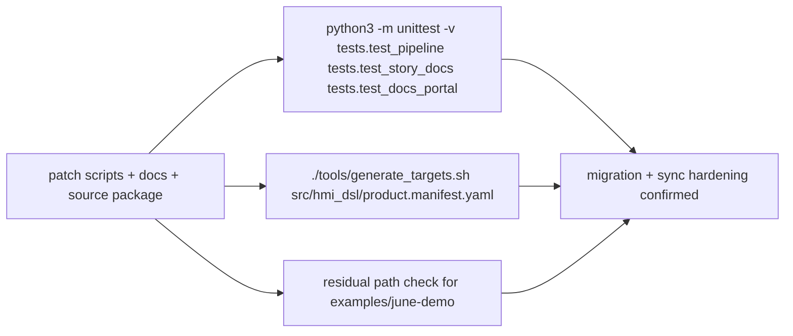

# Architecture Diagram

## 当前结构关系

```mermaid
flowchart LR
    SRC["metanc_hmi_dsl<br/>docs/ + src/hmi_dsl/ + tools/ + tests/"] --> EXPORT["export_to_metanc.sh<br/>shared package sync"]
    PKG["MetaNC/nrt/hmi<br/>downstream package root"] --> IMPORT["import_from_metanc.sh<br/>reverse shared sync"]
    EXPORT --> PKG
    IMPORT --> SRC

    CATALOG["src/hmi_dsl/story.catalog.yaml"] --> STORY["docs/acceptance_reference/story_pack/"]
    STORY --> DOCSHTML["docs_html/"]
    REPORTS["submodules/metanc_hmi_dsl_reports"] --> DOCSHTML

    EXPORT -.preserve.-> LOCAL["MetaNC local report entry surfaces<br/>docs/index.md<br/>docs/project/reports.md<br/>docs/acceptance_reference/story_pack/execution_links.md"]
    IMPORT -.preserve.-> SRCLOCAL["source-repo report-linked entry surfaces"]
```

## 结构迁移前后对比

```mermaid
flowchart TD
    OLD["旧结构<br/>examples/june-demo + docs/src + standalone story docs"] --> NEW["新结构<br/>src/hmi_dsl + docs/ main book + story_pack under docs/"]
    NEW --> OUTPUTS["统一产物<br/>generated/web<br/>generated/qml<br/>generated/distribution<br/>docs_html"]
```

## 验证链

```mermaid
flowchart LR
    PATCH["patch scripts + docs + source package"] --> TESTS["python3 -m unittest -v tests.test_pipeline tests.test_story_docs tests.test_docs_portal"]
    PATCH --> TARGETS["./tools/generate_targets.sh src/hmi_dsl/product.manifest.yaml"]
    PATCH --> CHECK["residual path check for examples/june-demo"]

    TESTS --> RESULT["migration + sync hardening confirmed"]
    TARGETS --> RESULT
    CHECK --> RESULT
```
