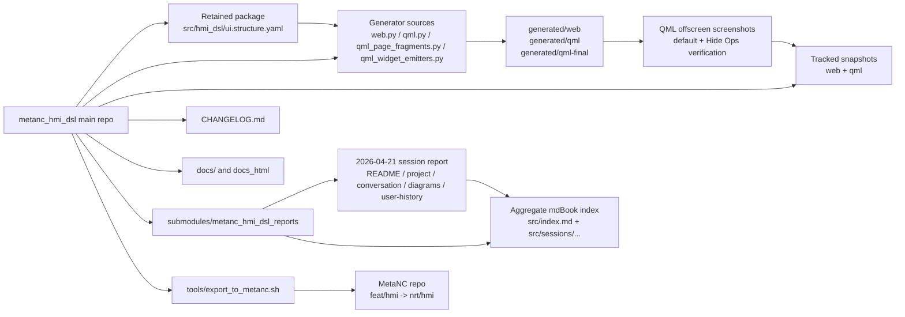

# Architecture Diagram

```mermaid
flowchart LR
    Repo[metanc_hmi_dsl main repo] --> Retained[Retained package<br/>src/hmi_dsl/ui.structure.yaml]
    Repo --> Gen[Generator sources<br/>web.py / qml.py / qml_page_fragments.py / qml_widget_emitters.py]
    Repo --> Snap[Tracked snapshots<br/>web + qml]
    Repo --> Changelog[CHANGELOG.md]
    Repo --> Docs[docs/ and docs_html]
    Repo --> ReportsSubmodule[submodules/metanc_hmi_dsl_reports]

    Retained --> Gen
    Gen --> Targets[generated/web<br/>generated/qml<br/>generated/qml-final]
    Targets --> QmlShot[QML offscreen screenshots<br/>default + Hide Ops verification]
    QmlShot --> Snap

    ReportsSubmodule --> Session[2026-04-21 session report<br/>README / project / conversation / diagrams / user-history]
    ReportsSubmodule --> Aggregate[Aggregate mdBook index<br/>src/index.md + src/sessions/...]
    Session --> Aggregate

    Repo --> ExportScript[tools/export_to_metanc.sh]
    ExportScript --> MetaNC[MetaNC repo<br/>feat/hmi -> nrt/hmi]
```
