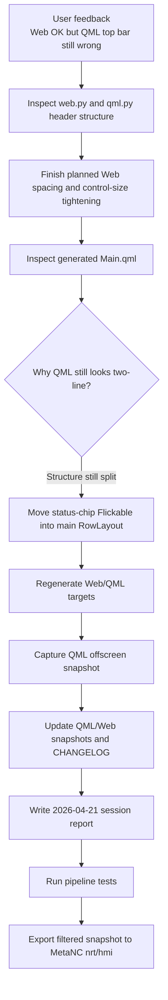

# Workflow Diagram

```mermaid
flowchart TD
    A[User feedback<br/>Web OK but QML top bar still wrong] --> B[Inspect web.py and qml.py header structure]
    B --> C[Finish planned Web spacing and control-size tightening]
    C --> D[Inspect generated Main.qml]
    D --> E{Why QML still looks two-line?}
    E -->|Structure still split| F[Move status-chip Flickable into main RowLayout]
    F --> G[Regenerate Web/QML targets]
    G --> H[Capture QML offscreen snapshot]
    H --> I[Update QML/Web snapshots and CHANGELOG]
    I --> J[Write 2026-04-21 session report]
    J --> K[Run pipeline tests]
    K --> L[Export filtered snapshot to MetaNC nrt/hmi]
```
