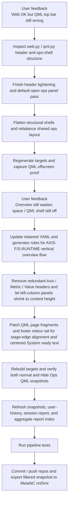

# Workflow Diagram

```mermaid
flowchart TD
    A[User feedback<br/>Web OK but QML top bar still wrong] --> B[Inspect web.py / qml.py header and ops-shell structure]
    B --> C[Finish header tightening and default-open ops panel pass]
    C --> D[Flatten structural shells and rebalance shared ops layout]
    D --> E[Regenerate targets and capture QML offscreen proof]
    E --> F[User feedback<br/>Overview still wastes space / QML shell still off]
    F --> G[Update retained YAML and generator rules for AXIS-F/S-RUNTIME vertical overview flow]
    G --> H[Remove redundant Axis / Metric / Value headers and let left-column panels shrink to content height]
    H --> I[Patch QML page fragments and footer notice rail for stage-edge alignment and centered System ready text]
    I --> J[Rebuild targets and verify both normal and Hide Ops QML snapshots]
    J --> K[Refresh snapshots, user-history, session report, and aggregate report index]
    K --> L[Run pipeline tests]
    L --> M[Commit / push repos and export filtered snapshot to MetaNC nrt/hmi]
```
