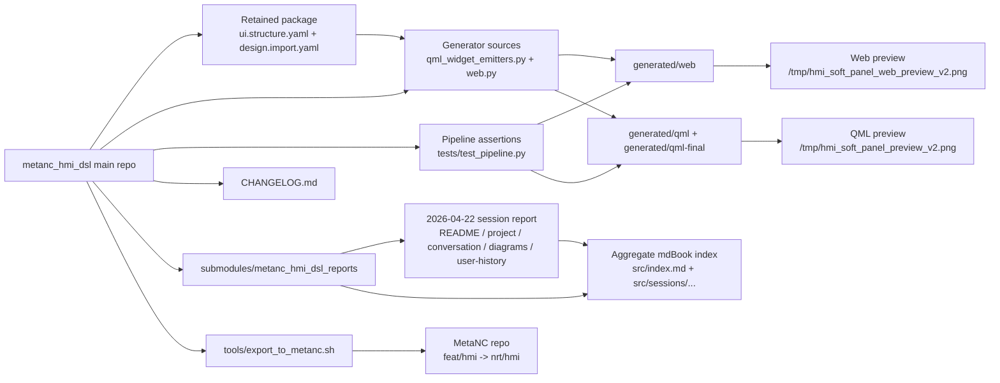

# Architecture Diagram

```mermaid
flowchart LR
    Repo[metanc_hmi_dsl main repo] --> Retained[Retained package<br/>ui.structure.yaml + design.import.yaml]
    Repo --> Emitters[Generator sources<br/>qml_widget_emitters.py + web.py]
    Repo --> Tests[Pipeline assertions<br/>tests/test_pipeline.py]
    Repo --> Changelog[CHANGELOG.md]
    Repo --> ReportsSubmodule[submodules/metanc_hmi_dsl_reports]

    Retained --> Emitters
    Emitters --> WebOut[generated/web]
    Emitters --> QmlOut[generated/qml + generated/qml-final]
    Tests --> WebOut
    Tests --> QmlOut

    QmlOut --> QmlShot[QML preview<br/>/tmp/hmi_soft_panel_preview_v2.png]
    WebOut --> WebShot[Web preview<br/>/tmp/hmi_soft_panel_web_preview_v2.png]

    ReportsSubmodule --> Session[2026-04-22 session report<br/>README / project / conversation / diagrams / user-history]
    ReportsSubmodule --> Aggregate[Aggregate mdBook index<br/>src/index.md + src/sessions/...]
    Session --> Aggregate

    Repo --> ExportScript[tools/export_to_metanc.sh]
    ExportScript --> MetaNC[MetaNC repo<br/>feat/hmi -> nrt/hmi]
```
