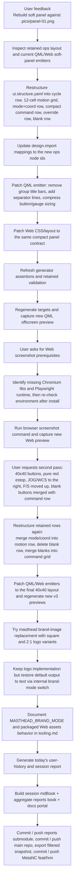

# Workflow Diagram

```mermaid
flowchart TD
    A[User feedback<br/>Rebuild soft panel against .pics/panel-01.png] --> B[Inspect retained ops layout and current QML/Web soft-panel emitters]
    B --> C[Restructure ui.structure.yaml into cycle row, 12-cell motion grid, mode+coord row, compact command row, override row, blank row]
    C --> D[Update design.import mappings to the new ops node ids]
    D --> E[Patch QML emitter: remove group title bars, add separator lines, compress button/gauge sizing]
    E --> F[Patch Web CSS/layout to the same compact panel contract]
    F --> G[Refresh generator assertions and retained validation]
    G --> H[Regenerate targets and capture new QML offscreen preview]
    H --> I[User asks for Web screenshot prerequisites]
    I --> J[Identify missing Chromium libs and Playwright runtime, then re-check environment after install]
    J --> K[Run browser screenshot command and capture new Web preview]
    K --> L[User requests second pass:<br/>40x40 buttons, pure red estop, JOG/WCS to the right, F/S moved up, blank buttons merged with command row]
    L --> M[Restructure retained rows again:<br/>merge mode/coord into motion row, delete blank row, merge blanks into command grid]
    M --> N[Patch QML/Web emitters to the final 40x40 layout and regenerate new v3 previews]
    N --> O[Try masthead brand-image replacement with square and 2:1 logo variants]
    O --> P[Keep logo implementation but restore default output to text via internal brand-mode switch]
    P --> Q[Document MASTHEAD_BRAND_MODE and packaged Web assets behavior in tooling.md]
    Q --> R[Generate today's user-history and session report]
    R --> S[Build session mdBook + aggregate reports book + docs portal]
    S --> T[Commit / push reports submodule, commit / push main repo, export filtered snapshot, commit / push MetaNC feat/hmi]
```
