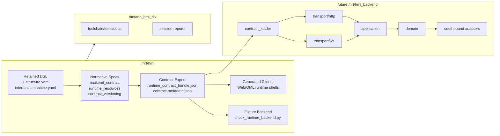

# Architecture Diagram

```mermaid
flowchart LR
    subgraph HMI["/nrt/hmi"]
        DSL["Retained DSL\nui.structure.yaml\ninterfaces.machine.yaml"]
        SPEC["Normative Specs\nbackend_contract\nruntime_resources\ncontract_versioning"]
        CONTRACT["Contract Export\nruntime_contract_bundle.json\ncontract.metadata.json"]
        CLIENTS["Generated Clients\nWeb/QML runtime shells"]
        FIXTURE["Fixture Backend\nmock_runtime_backend.py"]
    end

    subgraph BACKEND["future /nrt/hmi_backend"]
        LOADER["contract_loader"]
        HTTP["transport/http"]
        WS["transport/ws"]
        APP["application"]
        DOMAIN["domain"]
        ADAPTERS["southbound adapters"]
    end

    subgraph SOURCE["metanc_hmi_dsl"]
        TOOLS["toolchain/tests/docs"]
        REPORTS["session reports"]
    end

    DSL --> SPEC
    SPEC --> CONTRACT
    CONTRACT --> CLIENTS
    CONTRACT --> FIXTURE
    CONTRACT --> LOADER
    LOADER --> HTTP
    LOADER --> WS
    HTTP --> APP
    WS --> APP
    APP --> DOMAIN
    DOMAIN --> ADAPTERS

    HMI --> SOURCE
    SOURCE --> REPORTS
```
