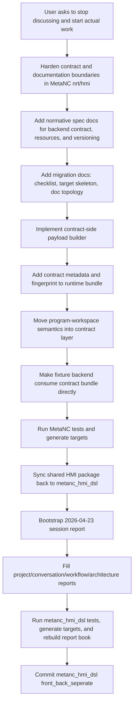

# Workflow Diagram

```mermaid
flowchart TD
    A[User asks to stop discussing and start actual work] --> B[Harden contract and documentation boundaries in MetaNC nrt/hmi]
    B --> C[Add normative spec docs for backend contract, resources, and versioning]
    C --> D[Add migration docs: checklist, target skeleton, doc topology]
    D --> E[Implement contract-side payload builder]
    E --> F[Add contract metadata and fingerprint to runtime bundle]
    F --> G[Move program-workspace semantics into contract layer]
    G --> H[Make fixture backend consume contract bundle directly]
    H --> I[Run MetaNC tests and generate targets]
    I --> J[Sync shared HMI package back to metanc_hmi_dsl]
    J --> K[Bootstrap 2026-04-23 session report]
    K --> L[Fill project/conversation/workflow/architecture reports]
    L --> M[Run metanc_hmi_dsl tests, generate targets, and rebuild report book]
    M --> N[Commit metanc_hmi_dsl front_back_seperate]
```
