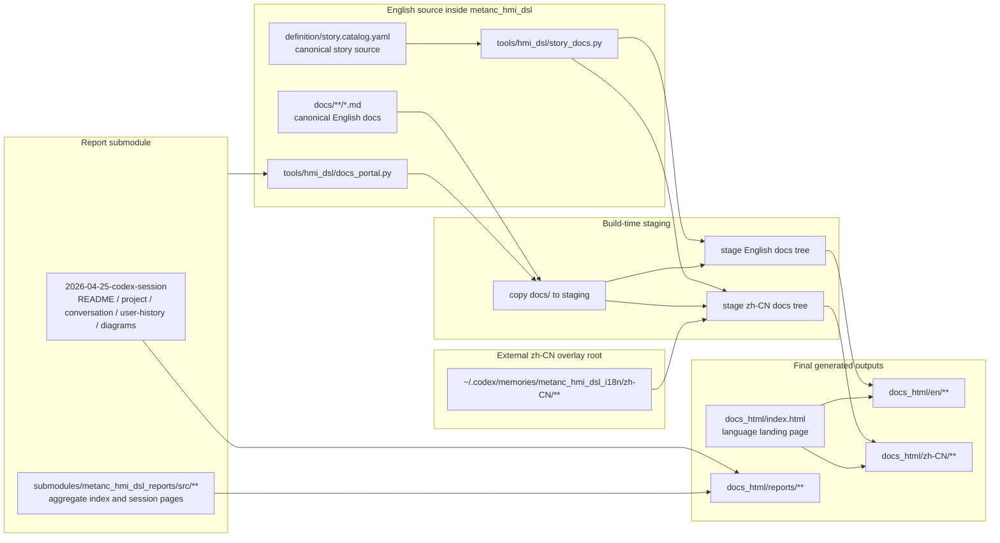

# Architecture Diagram

```mermaid
flowchart LR
    subgraph SOURCE["English source inside metanc_hmi_dsl"]
        DOCS["docs/**/*.md<br/>canonical English docs"]
        STORY["definition/story.catalog.yaml<br/>canonical story source"]
        PORTAL["tools/hmi_dsl/docs_portal.py"]
        STORYGEN["tools/hmi_dsl/story_docs.py"]
    end

    subgraph OVERLAY["External zh-CN overlay root"]
        OVL["~/.codex/memories/metanc_hmi_dsl_i18n/zh-CN/**"]
    end

    subgraph STAGING["Build-time staging"]
        COPY["copy docs/ to staging"]
        EN["stage English docs tree"]
        ZH["stage zh-CN docs tree"]
    end

    subgraph OUTPUT["Final generated outputs"]
        LANDING["docs_html/index.html<br/>language landing page"]
        ENHTML["docs_html/en/**"]
        ZHHTML["docs_html/zh-CN/**"]
        REPORTHTML["docs_html/reports/**"]
    end

    subgraph REPORTS["Report submodule"]
        SESSION["2026-04-25-codex-session<br/>README / project / conversation / user-history / diagrams"]
        AGG["submodules/metanc_hmi_dsl_reports/src/**<br/>aggregate index and session pages"]
    end

    DOCS --> COPY
    STORY --> STORYGEN
    STORYGEN --> EN
    STORYGEN --> ZH
    PORTAL --> COPY
    COPY --> EN
    COPY --> ZH
    OVL --> ZH
    EN --> ENHTML
    ZH --> ZHHTML
    LANDING --> ENHTML
    LANDING --> ZHHTML
    SESSION --> REPORTHTML
    AGG --> REPORTHTML
    REPORTS --> PORTAL
```
