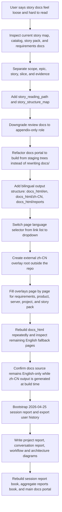

# Workflow Diagram

```mermaid
flowchart TD
    A[User says story docs feel loose and hard to read] --> B[Inspect current story map, catalog, story pack, and requirements docs]
    B --> C[Separate scope, epic, story, slice, and evidence]
    C --> D[Add story_reading_path and story_structure_map]
    D --> E[Downgrade review docs to appendix-only role]
    E --> F[Refactor docs portal to build from staging trees instead of rewriting docs/]
    F --> G[Add bilingual output structure: docs_html/en, docs_html/zh-CN, docs_html/reports]
    G --> H[Switch page language selector from link list to dropdown]
    H --> I[Create external zh-CN overlay root outside the repo]
    I --> J[Fill overlays page by page for requirements, product, server, project, and story pack]
    J --> K[Rebuild docs_html repeatedly and inspect remaining English fallback pages]
    K --> L[Confirm docs source remains English-only while zh-CN output is generated at build time]
    L --> M[Bootstrap 2026-04-25 session report and export user history]
    M --> N[Write project report, conversation report, workflow and architecture diagrams]
    N --> O[Rebuild session report book, aggregate reports book, and main docs portal]
```
