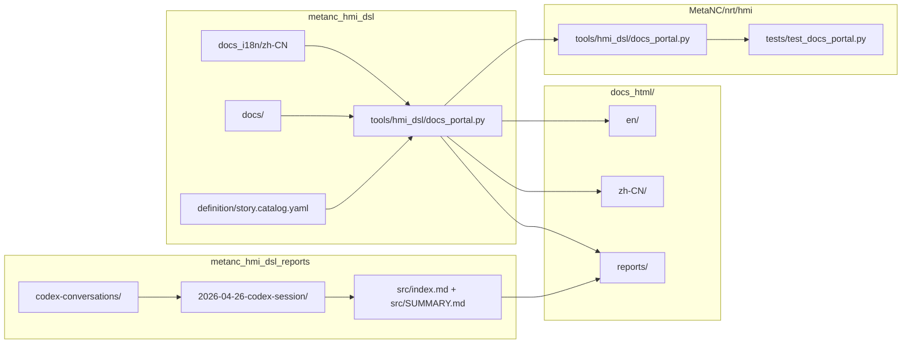

# Architecture Diagram

## docs and report publication topology

```mermaid
flowchart LR
    subgraph SourceRepo[metanc_hmi_dsl]
        Docs[docs/]
        I18N[docs_i18n/zh-CN]
        Portal[tools/hmi_dsl/docs_portal.py]
        Story[definition/story.catalog.yaml]
    end

    subgraph ReportsRepo[metanc_hmi_dsl_reports]
        Session[2026-04-26-codex-session/]
        Aggregate[src/index.md + src/SUMMARY.md]
        Export[codex-conversations/]
    end

    subgraph FinalSite[docs_html/]
        EN[en/]
        ZH[zh-CN/]
        PublishedReports[reports/]
    end

    subgraph Downstream[MetaNC/nrt/hmi]
        MirrorPortal[tools/hmi_dsl/docs_portal.py]
        MirrorTests[tests/test_docs_portal.py]
    end

    Story --> Portal
    Docs --> Portal
    I18N --> Portal
    Session --> Aggregate
    Export --> Session
    Aggregate --> PublishedReports
    Portal --> EN
    Portal --> ZH
    Portal --> PublishedReports
    Portal --> MirrorPortal
    MirrorPortal --> MirrorTests
```
