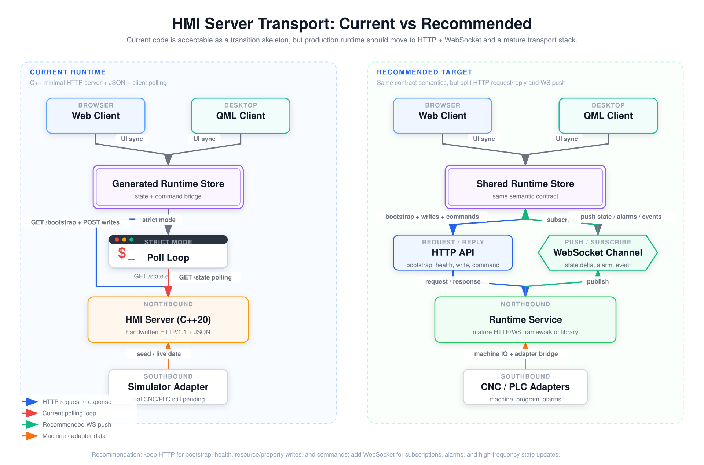
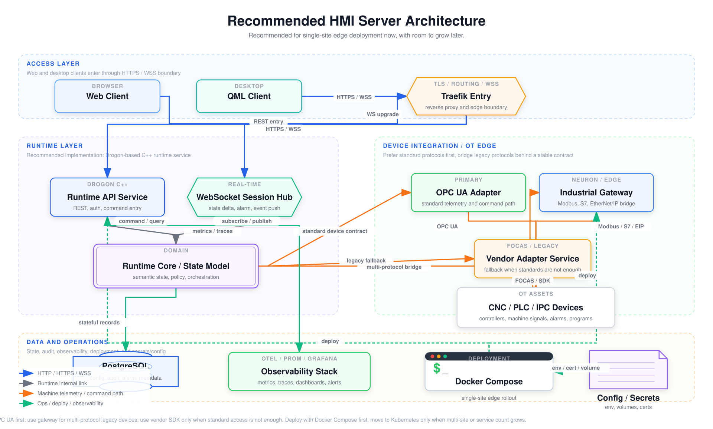

# HMI Server Recommendation

## 1. 结论

针对当前 `HMI server` 还处在最小 `HTTP + JSON + polling` 过渡态、后续又要接入 `CNC / PLC / IPC` 的情况，推荐采用一套“单站点先落地、后续可扩展”的组合方案：

- `Runtime` 继续保留 `C++` 主体
- northbound 从手写 socket/HTTP 演进到 `Drogon + HTTPS/REST + WebSocket`
- 设备接入优先走 `OPC UA`
- 多品牌 legacy 协议先收口到工业网关，再由 runtime 消费统一语义
- 只有在标准协议不够时，才补厂商 `SDK / 专有协议` 适配
- 数据与运维先采用 `PostgreSQL + OpenTelemetry + Prometheus + Grafana + Docker Compose + Traefik`

## 2. 为什么不建议继续停留在当前形态

1. `HTTP + 高频轮询` 不适合长期承载高频状态、告警和异步命令结果。
2. hand-written northbound transport 后续会不断背负连接管理、`WSS`、鉴权和观测成本。
3. southbound 如果直接把所有 PLC/CNC 协议都塞进主进程，后期维护风险会快速放大。
4. 设备原始地址空间和 HMI 语义模型没有分层时，前端和设备细节会被直接耦合。

## 3. 通信模式判断

推荐保留 `HTTP`，但只让它承担“请求/应答型”职责；高频或异步流转交给 `WebSocket`。

- `HTTP`：`bootstrap`、`health`、`property/resource write`、`command invoke`
- `WebSocket`：`state delta`、`alarms/events`、`command result lifecycle`

图文件：

- [PNG](../assets/hmi-server-recommendation/hmi-server-transport-current-vs-target.png)
- [SVG](../assets/hmi-server-recommendation/hmi-server-transport-current-vs-target.svg)

## 4. 推荐目标架构

推荐形态：

1. `Web Client` 和 `QML Client` 统一通过 `Traefik` 进入 `HTTPS / WSS` 边界。
2. `Runtime API Service` 负责 `REST`、鉴权、命令入口和管理接口。
3. `WebSocket Session Hub` 负责实时状态、告警和事件推送。
4. `Runtime Core / State Model` 负责语义状态、策略、权限边界和指令编排。
5. southbound 侧优先通过 `OPC UA Adapter` 对接标准化设备。
6. legacy 协议通过 `Industrial Gateway` 收口，例如 `Modbus / S7 / EtherNet/IP`。
7. 厂商标准不够时，再增加单独的 `Vendor Adapter Service`，例如 `FOCAS / SDK`。
8. `PostgreSQL` 存配置、审计、报警、程序元数据和运营数据。
9. `OpenTelemetry + Prometheus + Grafana` 负责观测。
10. 单站点先用 `Docker Compose`，多站点和服务规模扩大后再考虑 `Kubernetes`。

图文件：

- [PNG](../assets/hmi-server-recommendation/hmi-recommended-target-architecture.png)
- [SVG](../assets/hmi-server-recommendation/hmi-recommended-target-architecture.svg)

## 5. 方案对比

| 方案 | Northbound | Southbound | 部署/管理 | 优点 | 风险/代价 | 适用度 |
| --- | --- | --- | --- | --- | --- | --- |
| `A. C++ 一体化边缘服务` | `Drogon + HTTP/WS` | `open62541 + libmodbus + libplctag + vendor SDK` | `Compose + Traefik + Prom/Grafana` | 最贴近现有代码，性能和本地集成最好 | 协议要自己维护，品牌一多就会变重 | 高 |
| `B. 工业网关 + HMI Runtime` | `Drogon/oat++ + HTTP/WS` | 设备先接工业网关，再由 runtime 消费统一数据 | `Compose` 起步，可分节点部署 | 多品牌接入快，OT/IT 边界清晰 | 增加外部平台组件，调试链路更长 | 很高 |
| `C. 平台化微服务` | 前端 `HTTP/WS`，服务间 `gRPC` | adapter/gateway/driver 服务化 | `Kubernetes + Ingress + OTel` | 适合多站点、多团队、多系统 | 前期复杂度最高 | 中 |

## 6. 最终推荐

建议采用 `A + B` 的混合方案：

- northbound 保持自研 runtime，但 transport 换成成熟框架
- southbound 优先标准协议，legacy 协议尽量经工业网关收口
- 厂商 SDK 只作为补充，不作为第一选择

推荐技术栈：

- `C++20`
- `Drogon`
- `HTTPS / REST / WebSocket`
- `Traefik`
- `OPC UA`
- 工业网关收口 `Modbus / S7 / EtherNet/IP`
- `PostgreSQL`
- `OpenTelemetry`
- `Prometheus`
- `Grafana`
- `Docker Compose`

## 7. 协议与集成策略

推荐接入优先级：

1. 优先判断设备是否提供 `OPC UA Server`
2. 如果是机床监控和生产数据统一，可评估 `MTConnect`
3. 如果现场协议种类多、品牌杂，优先上工业网关
4. 只有在标准链路覆盖不了控制或语义时，再增加专有 adapter

不建议的做法：

- 不要把 PLC/CNC 原始地址直接暴露给前端
- 不要把所有协议 driver 直接堆进一个 monolith 进程
- 不要把高频状态同步长期建立在 polling 上
- 不要让 `MQTT / WS` 直接承担安全关键运动控制

## 8. 实施清单

### 第一阶段：必须做

- 把当前 hand-written HTTP transport 替换为 `Drogon`
- 明确 northbound contract：`REST` 和 `WS` 的边界
- 建立 `Runtime Core / State Model` 与 southbound adapter 的分层
- 接入 `Traefik`，完成 `HTTPS / WSS` 入口
- 选定 `PostgreSQL` 作为主库
- 打通最小观测链路：`OpenTelemetry + Prometheus + Grafana`
- 用 `Docker Compose` 把 runtime、db、proxy、observability 跑通

### 第二阶段：建议尽快做

- 做 `OPC UA Adapter`
- 如果现场设备品牌复杂，引入工业网关收口 legacy 协议
- 给 runtime 增加 adapter 健康、连接状态、告警推送
- 给命令执行增加审计和异步结果生命周期
- 给部署加 `env / volume / cert` 规范

### 第三阶段：按规模再做

- 时序数据量上来后，再评估专门时序库
- 出现多站点或多服务规模后，再考虑 `Kubernetes`
- 设备协议增长到维护困难时，再继续拆 adapter 服务

## 9. 阅读导出

- [PDF 导出版](../assets/hmi-server-recommendation/hmi-server-recommendation.pdf)
- [通信模式图 PNG](../assets/hmi-server-recommendation/hmi-server-transport-current-vs-target.png)
- [推荐架构图 PNG](../assets/hmi-server-recommendation/hmi-recommended-target-architecture.png)

## 10. 参考

- Drogon: <https://drogon.org/>
- open62541 / OPC UA: <https://open62541.org/doc/master/>
- libmodbus: <https://libmodbus.org/>
- libplctag: <https://libplctag.github.io/>
- MTConnect: <https://www.mtconnect.org/>
- EMQX Neuron: <https://www.emqx.com/en/products/emqx-neuron>
- Traefik: <https://doc.traefik.io/traefik/master/expose/overview/>
- Docker Compose: <https://docs.docker.com/guides/docker-compose/>
- Kubernetes: <https://kubernetes.io/docs/concepts/overview/>
- OpenTelemetry C++: <https://opentelemetry.io/docs/languages/cpp/>
- Prometheus: <https://prometheus.io/docs/tutorials/getting_started/>
- Grafana Docker: <https://grafana.com/docs/grafana/latest/setup-grafana/installation/docker/>
- gRPC C++: <https://grpc.io/docs/languages/cpp/>
- PostgreSQL: <https://www.postgresql.org/docs/current/index.html>
