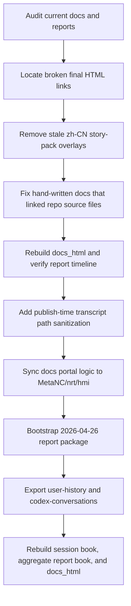

# Workflow Diagram

```mermaid
flowchart TD
    A[Audit current docs and reports] --> B[Locate broken final HTML links]
    B --> C[Remove stale zh-CN story-pack overlays]
    C --> D[Fix hand-written docs that linked repo source files]
    D --> E[Rebuild docs_html and verify report timeline]
    E --> F[Add publish-time transcript path sanitization]
    F --> G[Sync docs portal logic to MetaNC/nrt/hmi]
    G --> H[Bootstrap 2026-04-26 report package]
    H --> I[Export user-history and codex-conversations]
    I --> J[Rebuild session book, aggregate report book, and docs_html]
```
