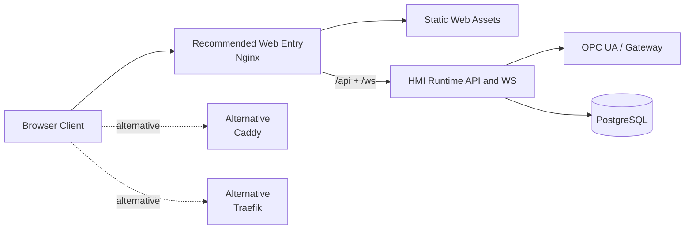

# Architecture Diagram

```mermaid
flowchart LR
    Browser[Browser Client]
    Entry[Recommended Web Entry<br/>Nginx]
    Alt1[Alternative<br/>Caddy]
    Alt2[Alternative<br/>Traefik]
    Static[Static Web Assets]
    Runtime[HMI Runtime API and WS]
    Gateway[OPC UA / Gateway]
    DB[(PostgreSQL)]

    Browser --> Entry
    Browser -. alternative .-> Alt1
    Browser -. alternative .-> Alt2
    Entry --> Static
    Entry -->|/api + /ws| Runtime
    Runtime --> Gateway
    Runtime --> DB
```
