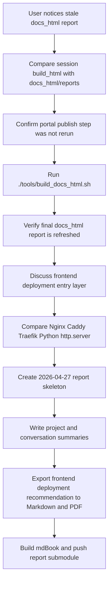

# Workflow Diagram

```mermaid
flowchart TD
    A[User notices stale docs_html report] --> B[Compare session build_html with docs_html/reports]
    B --> C[Confirm portal publish step was not rerun]
    C --> D[Run ./tools/build_docs_html.sh]
    D --> E[Verify final docs_html report is refreshed]
    E --> F[Discuss frontend deployment entry layer]
    F --> G[Compare Nginx Caddy Traefik Python http.server]
    G --> H[Create 2026-04-27 report skeleton]
    H --> I[Write project and conversation summaries]
    I --> J[Export frontend deployment recommendation to Markdown and PDF]
    J --> K[Build mdBook and push report submodule]
```
