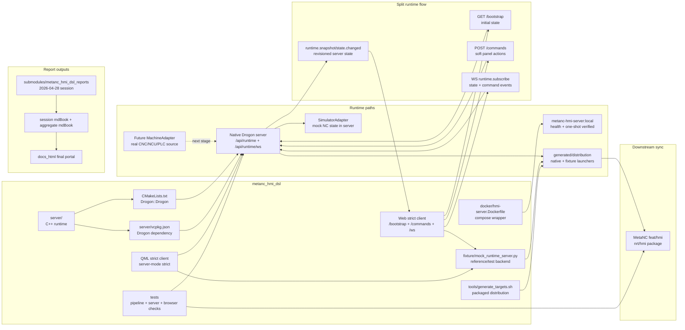

# Architecture Diagram

```mermaid
flowchart LR
    subgraph SourceRepo["metanc_hmi_dsl"]
        Server["server/\nC++ runtime"]
        CMake["CMakeLists.txt\nDrogon::Drogon"]
        Vcpkg["server/vcpkg.json\nDrogon dependency"]
        Docker["docker/hmi-server.Dockerfile\ncompose wrapper"]
        Tools["tools/generate_targets.sh\npackaged distribution"]
        WebClient["Web strict client\n/bootstrap + /commands + /ws"]
        QmlClient["QML strict client\nserver-mode strict"]
        Fixture["fixture/mock_runtime_server.py\nreference/test backend"]
        Tests["tests\npipeline + server + browser checks"]
    end

    subgraph Runtime["Runtime paths"]
        Native["Native Drogon server\n/api/runtime + /api/runtime/ws"]
        Sim["SimulatorAdapter\nmock NC state in server"]
        FutureMachine["Future MachineAdapter\nreal CNC/NCU/PLC source"]
        Container["metanc-hmi-server:local\nhealth + one-shot verified"]
        Generated["generated/distribution\nnative + fixture launchers"]
    end

    subgraph SplitFlow["Split runtime flow"]
        Bootstrap["GET /bootstrap\ninitial state"]
        CommandPost["POST /commands\nsoft panel actions"]
        Subscribe["WS runtime.subscribe\nstate + command events"]
        StatePub["runtime.snapshot/state.changed\nrevisioned server state"]
    end

    subgraph Downstream["Downstream sync"]
        MetaNC["MetaNC feat/hmi\nnrt/hmi package"]
    end

    subgraph Reports["Report outputs"]
        ReportSubmodule["submodules/metanc_hmi_dsl_reports\n2026-04-28 session"]
        Mdbook["session mdBook + aggregate mdBook"]
        DocsHtml["docs_html final portal"]
    end

    Server --> CMake
    Server --> Vcpkg
    CMake --> Native
    Vcpkg --> Native
    Docker --> Container
    Native --> Sim
    FutureMachine -.next stage.-> Native
    Native --> Generated
    Fixture --> Generated
    WebClient --> Bootstrap
    WebClient --> CommandPost
    WebClient --> Subscribe
    Bootstrap --> Native
    CommandPost --> Native
    Subscribe --> Native
    Native --> StatePub
    StatePub --> WebClient
    QmlClient --> Native
    WebClient --> Fixture
    QmlClient --> Fixture
    Tools --> Generated
    Generated --> MetaNC
    Tests --> Native
    Tests --> MetaNC
    ReportSubmodule --> Mdbook
    Mdbook --> DocsHtml
```
