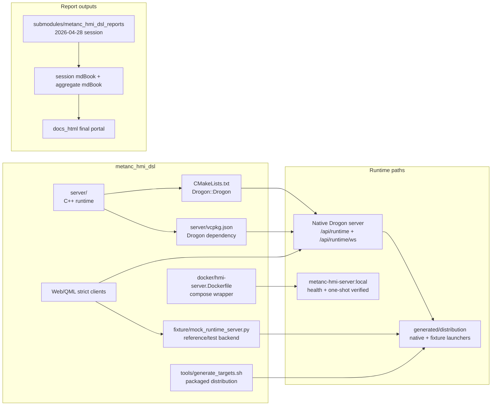

# Architecture Diagram

```mermaid
flowchart LR
    subgraph SourceRepo["metanc_hmi_dsl"]
        Server["server/\nC++ runtime"]
        CMake["CMakeLists.txt\nDrogon::Drogon"]
        Vcpkg["server/vcpkg.json\nDrogon dependency"]
        Docker["docker/hmi-server.Dockerfile\ncompose wrapper"]
        Tools["tools/generate_targets.sh\npackaged distribution"]
        Client["Web/QML strict clients"]
        Fixture["fixture/mock_runtime_server.py\nreference/test backend"]
    end

    subgraph Runtime["Runtime paths"]
        Native["Native Drogon server\n/api/runtime + /api/runtime/ws"]
        Container["metanc-hmi-server:local\nhealth + one-shot verified"]
        Generated["generated/distribution\nnative + fixture launchers"]
    end

    subgraph Reports["Report outputs"]
        ReportSubmodule["submodules/metanc_hmi_dsl_reports\n2026-04-28 session"]
        Mdbook["session mdBook + aggregate mdBook"]
        DocsHtml["docs_html final portal"]
    end

    Server --> CMake
    Server --> Vcpkg
    CMake --> Native
    Vcpkg --> Native
    Docker --> Container
    Native --> Generated
    Fixture --> Generated
    Client --> Native
    Client --> Fixture
    Tools --> Generated
    ReportSubmodule --> Mdbook
    Mdbook --> DocsHtml
```
