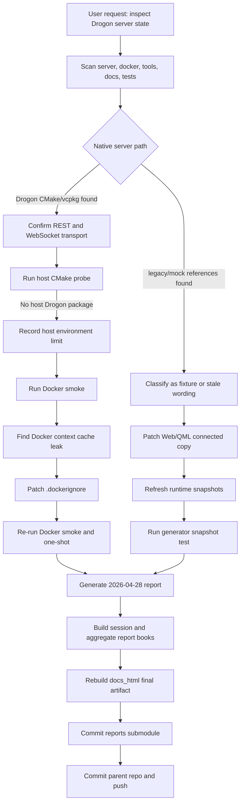

# Workflow Diagram

```mermaid
flowchart TD
    A[User request: inspect Drogon server state] --> B[Scan server, docker, tools, docs, tests]
    B --> C{Native server path}
    C -->|Drogon CMake/vcpkg found| D[Confirm REST and WebSocket transport]
    C -->|legacy/mock references found| E[Classify as fixture or stale wording]
    D --> F[Run host CMake probe]
    F -->|No host Drogon package| G[Record host environment limit]
    G --> H[Run Docker smoke]
    H --> I[Find Docker context cache leak]
    I --> J[Patch .dockerignore]
    E --> K[Patch Web/QML connected copy]
    K --> L[Refresh runtime snapshots]
    J --> M[Re-run Docker smoke and one-shot]
    L --> N[Run generator snapshot test]
    M --> O[Generate 2026-04-28 report]
    N --> O
    O --> P[Build session and aggregate report books]
    P --> Q[Rebuild docs_html final artifact]
    Q --> R[Commit reports submodule]
    R --> S[Commit parent repo and push]
```
