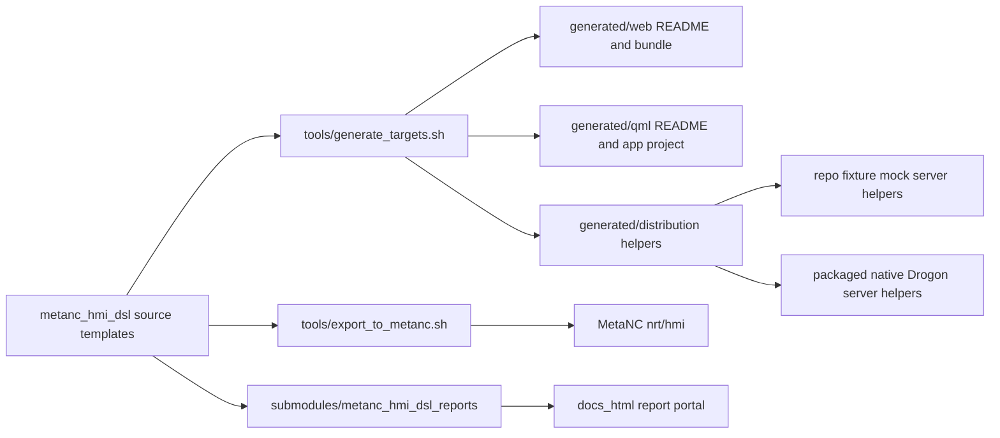

# Architecture Diagram

```mermaid
flowchart LR
    DSL[metanc_hmi_dsl source templates] --> GEN[tools/generate_targets.sh]
    GEN --> WEB[generated/web README and bundle]
    GEN --> QML[generated/qml README and app project]
    GEN --> DIST[generated/distribution helpers]
    DIST --> FIXTURE[repo fixture mock server helpers]
    DIST --> NATIVE[packaged native Drogon server helpers]
    DSL --> EXPORT[tools/export_to_metanc.sh]
    EXPORT --> METANC[MetaNC nrt/hmi]
    DSL --> REPORTS[submodules/metanc_hmi_dsl_reports]
    REPORTS --> DOCS[docs_html report portal]
```
