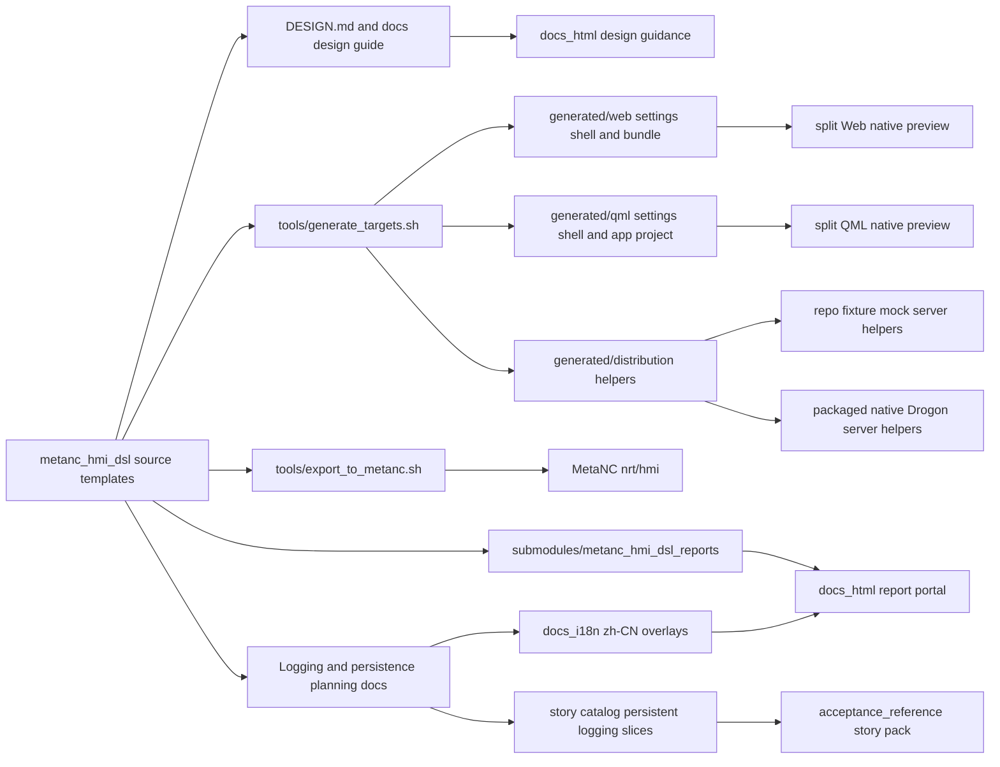

# Architecture Diagram

```mermaid
flowchart LR
    DSL[metanc_hmi_dsl source templates] --> GEN[tools/generate_targets.sh]
    DSL --> DESIGN[DESIGN.md and docs design guide]
    DESIGN --> DOCSHTML[docs_html design guidance]
    GEN --> WEB[generated/web settings shell and bundle]
    GEN --> QML[generated/qml settings shell and app project]
    GEN --> DIST[generated/distribution helpers]
    WEB --> WEBRUN[split Web native preview]
    QML --> QMLRUN[split QML native preview]
    DIST --> FIXTURE[repo fixture mock server helpers]
    DIST --> NATIVE[packaged native Drogon server helpers]
    DSL --> EXPORT[tools/export_to_metanc.sh]
    EXPORT --> METANC[MetaNC nrt/hmi]
    DSL --> REPORTS[submodules/metanc_hmi_dsl_reports]
    REPORTS --> DOCS[docs_html report portal]
    DSL --> PERSIST[Logging and persistence planning docs]
    PERSIST --> STORY[story catalog persistent logging slices]
    STORY --> PACK[acceptance_reference story pack]
    PERSIST --> I18N[docs_i18n zh-CN overlays]
    I18N --> DOCS
```
