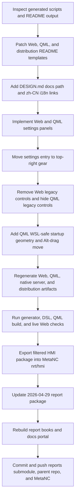

# Workflow Diagram

```mermaid
flowchart TD
    A[Inspect generated scripts and README output] --> B[Patch Web, QML, and distribution README templates]
    B --> C[Add DESIGN.md docs path and zh-CN i18n links]
    C --> D[Implement Web and QML settings panels]
    D --> E[Move settings entry to top-right gear]
    E --> F[Remove Web legacy controls and hide QML legacy controls]
    F --> G[Add QML WSL-safe startup geometry and Alt-drag move]
    G --> H[Regenerate Web, QML, native server, and distribution artifacts]
    H --> I[Run generator, DSL, QML build, and live Web checks]
    I --> J[Export filtered HMI package into MetaNC nrt/hmi]
    J --> K[Update 2026-04-29 report package]
    K --> L[Rebuild report books and docs portal]
    L --> M[Commit and push reports submodule, parent repo, and MetaNC]
```
