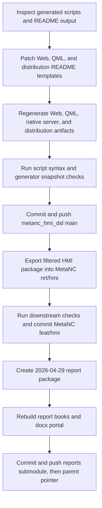

# Workflow Diagram

```mermaid
flowchart TD
    A[Inspect generated scripts and README output] --> B[Patch Web, QML, and distribution README templates]
    B --> C[Regenerate Web, QML, native server, and distribution artifacts]
    C --> D[Run script syntax and generator snapshot checks]
    D --> E[Commit and push metanc_hmi_dsl main]
    E --> F[Export filtered HMI package into MetaNC nrt/hmi]
    F --> G[Run downstream checks and commit MetaNC feat/hmi]
    G --> H[Create 2026-04-29 report package]
    H --> I[Rebuild report books and docs portal]
    I --> J[Commit and push reports submodule, then parent pointer]
```
