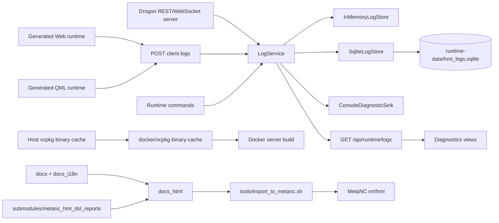

# Architecture Diagram

```mermaid
flowchart LR
    WEB[Generated Web runtime] --> CLIENTLOG[POST client logs]
    QML[Generated QML runtime] --> CLIENTLOG
    HTTP[Drogon REST/WebSocket server] --> SERVICE[LogService]
    CLIENTLOG --> SERVICE
    COMMANDS[Runtime commands] --> SERVICE
    SERVICE --> MEMORY[InMemoryLogStore]
    SERVICE --> SQLITE[SqliteLogStore]
    SQLITE --> DB[(runtime-data/hmi_logs.sqlite)]
    SERVICE --> CONSOLE[ConsoleDiagnosticSink]
    SERVICE --> QUERY[GET /api/runtime/logs]
    QUERY --> DIAG[Diagnostics views]
    HOSTCACHE[Host vcpkg binary cache] --> DOCKERCTX[docker/vcpkg-binary-cache]
    DOCKERCTX --> DOCKER[Docker server build]
    DOCS[docs + docs_i18n] --> PORTAL[docs_html]
    REPORTS[submodules/metanc_hmi_dsl_reports] --> PORTAL
    PORTAL --> EXPORT[tools/export_to_metanc.sh]
    EXPORT --> METANC[MetaNC nrt/hmi]
```
