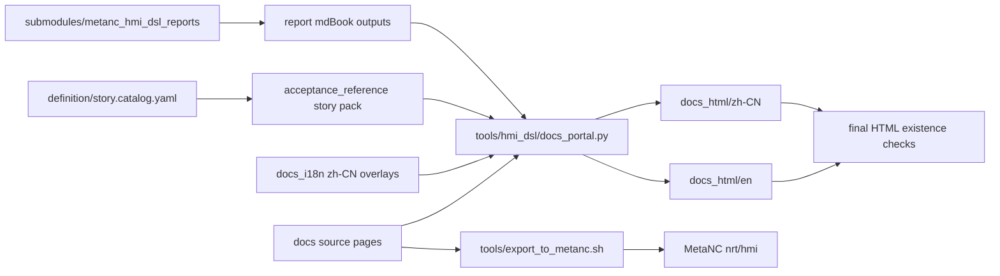

# Architecture Diagram

```mermaid
flowchart LR
    DOCS[docs source pages] --> PORTAL[tools/hmi_dsl/docs_portal.py]
    I18N[docs_i18n zh-CN overlays] --> PORTAL
    STORY[definition/story.catalog.yaml] --> PACK[acceptance_reference story pack]
    PACK --> PORTAL
    PORTAL --> EN[docs_html/en]
    PORTAL --> ZH[docs_html/zh-CN]
    EN --> CHECK[final HTML existence checks]
    ZH --> CHECK
    REPORTS[submodules/metanc_hmi_dsl_reports] --> REPORTBOOKS[report mdBook outputs]
    REPORTBOOKS --> PORTAL
    DOCS --> EXPORT[tools/export_to_metanc.sh]
    EXPORT --> METANC[MetaNC nrt/hmi]
```
