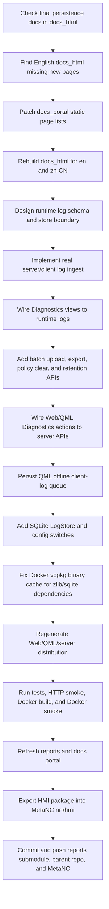

# Workflow Diagram

```mermaid
flowchart TD
    A[Check final persistence docs in docs_html] --> B[Find English docs_html missing new pages]
    B --> C[Patch docs_portal static page lists]
    C --> D[Rebuild docs_html for en and zh-CN]
    D --> E[Design runtime log schema and store boundary]
    E --> F[Implement real server/client log ingest]
    F --> G[Wire Diagnostics views to runtime logs]
    G --> H[Add batch upload, export, policy clear, and retention APIs]
    H --> I[Wire Web/QML Diagnostics actions to server APIs]
    I --> J[Persist QML offline client-log queue]
    J --> K[Add SQLite LogStore and config switches]
    K --> L[Fix Docker vcpkg binary cache for zlib/sqlite dependencies]
    L --> M[Regenerate Web/QML/server distribution]
    M --> N[Run tests, HTTP smoke, Docker build, and Docker smoke]
    N --> O[Refresh reports and docs portal]
    O --> P[Export HMI package into MetaNC nrt/hmi]
    P --> Q[Commit and push reports submodule, parent repo, and MetaNC]
```
