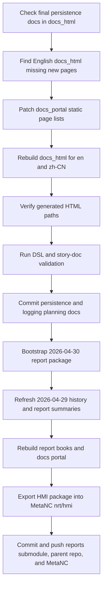

# Workflow Diagram

```mermaid
flowchart TD
    A[Check final persistence docs in docs_html] --> B[Find English docs_html missing new pages]
    B --> C[Patch docs_portal static page lists]
    C --> D[Rebuild docs_html for en and zh-CN]
    D --> E[Verify generated HTML paths]
    E --> F[Run DSL and story-doc validation]
    F --> G[Commit persistence and logging planning docs]
    G --> H[Bootstrap 2026-04-30 report package]
    H --> I[Refresh 2026-04-29 history and report summaries]
    I --> J[Rebuild report books and docs portal]
    J --> K[Export HMI package into MetaNC nrt/hmi]
    K --> L[Commit and push reports submodule, parent repo, and MetaNC]
```
