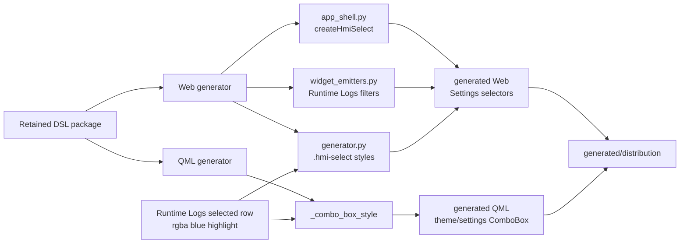

# Architecture Diagram

```mermaid
flowchart LR
    DSL[Retained DSL package] --> WebGen[Web generator]
    DSL --> QmlGen[QML generator]

    WebGen --> AppShell[app_shell.py<br/>createHmiSelect]
    WebGen --> WidgetEmitters[widget_emitters.py<br/>Runtime Logs filters]
    WebGen --> WebCSS[generator.py<br/>.hmi-select styles]
    AppShell --> WebOut[generated Web<br/>Settings selectors]
    WidgetEmitters --> WebOut
    WebCSS --> WebOut

    QmlGen --> ComboStyle[_combo_box_style]
    ComboStyle --> QmlOut[generated QML<br/>theme/settings ComboBox]

    LogsStyle[Runtime Logs selected row<br/>rgba blue highlight] --> WebCSS
    LogsStyle --> ComboStyle

    WebOut --> Distribution[generated/distribution]
    QmlOut --> Distribution
```
